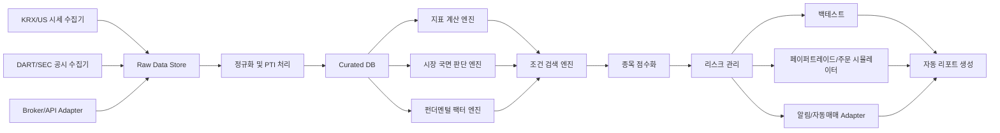
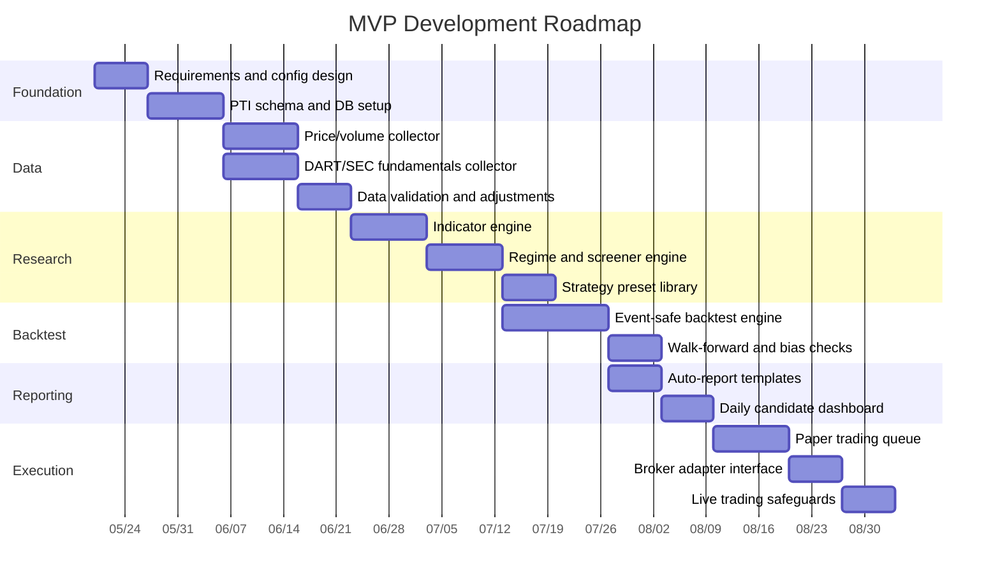

# 주식 매매기법 심층 리서치 보고서

> 보관 목적: 초기 개발기획 단계에서 검토한 리서치 아카이브입니다.
> 이 문서는 투자 추천, 운용 지시, 실거래 가이드가 아니며, 현재 구현/검증 상태의 기준 문서도 아닙니다.
> Phase 3D 기능 및 검증 상태는 루트 `README.md`, `docs/VALIDATION.md`, `Memory.md`를 기준으로 확인합니다.

## Executive Summary

본 보고서는 특정 종목 추천이 아니라, **상위권 트레이더들이 반복적으로 사용하는 검증 가능한 원칙**을 가격·거래량·추세·모멘텀·변동성·수급·실적·시장 국면·리스크 관리 관점에서 분해하고, 이를 **프로그램으로 구현 가능한 룰 엔진**으로 재구성하는 데 목적이 있다. 학술적으로 가장 강한 근거는 **추세추종, 크로스섹션 모멘텀, 52주 신고가 효과, 업종/섹터 모멘텀, 가치·품질·수익성 팩터** 쪽에 몰려 있으며, 이들은 장기 샘플과 다수 시장에서 반복적으로 관찰되었다. 반면 **CAN SLIM, VCP, Darvas Box, Stage Analysis** 같은 유명한 명명 전략은 그 자체가 학술 팩터라기보다, 위 요소들을 실전형으로 묶은 **하이브리드 규칙 집합**으로 보는 편이 정확하다. citeturn25view0turn25view1turn1search4turn25view3turn6search9turn3search1turn1search5turn25view4

핵심 결론은 단순하다. **시장 전체 추세가 우상향인 국면에서**, **강한 섹터의 강한 종목**을 고르고, **상대강도·신고가 근접성·거래량 증가·변동성 수축 후 확장**을 확인한 뒤, **실적 개선과 품질 필터**를 얹고, 마지막으로 **손절·트레일링·포지션 사이징**을 기계적으로 집행하는 구조가 가장 일관되게 재현 가능하다. 이 접근은 O’Neil 계열 성장주 방법론, Minervini의 VCP, Weinstein의 Stage Analysis, Turtle의 채널 돌파 규칙과도 구조적으로 많이 겹친다. citeturn37search18turn8search3turn7search5turn10search18turn31view0turn31view2

프로그램 개발 관점에서 가장 현실적인 출발점은 **일봉 종가 기반 EOD 스크리닝 + 백테스트 + 자동 리포트 + 페이퍼트레이딩**이다. 이유는 세 가지다. 첫째, 생존자 편향과 룩어헤드 바이어스를 제어하기가 상대적으로 쉽다. 둘째, 한국·미국 시장 모두 공식/실무용 API와 공시 데이터로 구축 가능하다. 셋째, 추세·돌파·상대강도·실적 개선 전략은 intraday보다 EOD에서 규칙화가 더 안정적이다. 백테스트는 반드시 **사용자 설정형 기간·리밸런싱·슬리피지**로 설계하고, 동일 데이터셋에서 수십 개 파라미터를 뒤지는 방식은 White의 reality check, PBO, deflated Sharpe ratio 같은 검정을 통해 제어해야 한다. citeturn25view5turn34search0turn34search14turn22search20turn22search12

한국장과 미국장은 구조적으로 다르다. 한국은 KRX 정규장이 09:00~15:30이고 일일 가격제한폭이 ±30%이며, 2025년 3월 31일부터 공매도가 전면 재개되었다. 미국은 NYSE/Nasdaq 정규장이 09:30~16:00 ET이고 프리·애프터마켓이 더 길며, 한국식 고정 가격제한폭 대신 LULD 가격밴드가 작동한다. 이 차이는 돌파 체결 로직, 갭 리스크, 스탑 슬리피지, 공매도/대차 데이터, 시간대 처리와 자동매매 연결 방식에 직접 영향을 준다. citeturn28search0turn12search2turn13view2turn14search0turn15search1turn16search0turn16search8

## 핵심 매매철학 요약

추세추종과 모멘텀은 자주 혼용되지만, 엄밀히는 다르다. **추세추종**은 “이 자산 자체가 상승 추세인가”를 본다. **모멘텀/상대강도**는 “어떤 종목이 다른 종목이나 벤치마크보다 더 강한가”를 본다. 전자는 time-series 관점, 후자는 cross-sectional 관점이다. 이 차이를 분리해 구현해야 시장 필터와 종목 랭킹을 동시에 설계할 수 있다. citeturn25view1turn25view0turn24search3

| 구분 | 핵심 질문 | 대표 구현 방식 | 대표 근거 |
|---|---|---|---|
| 추세추종 | 이 종목/지수의 방향이 위인가 아래인가 | `close > SMA200`, `12M excess return > 0`, Donchian 돌파 | time-series momentum, 장기 trend following citeturn25view1turn1search4 |
| 모멘텀 투자 | 최근 강했던 종목이 앞으로도 강할 가능성이 큰가 | `12-1 return ranking`, decile/percentile 랭킹 | Jegadeesh-Titman 모멘텀 citeturn25view0 |
| 상대강도 | 벤치마크/동종업종보다 더 강한가 | `stock_return - benchmark_return`, RS rank | MSCI momentum, IBD 리더십 개념 citeturn24search3turn37search18 |

실제로 상위권 트레이더들의 공통분모는 “비밀 지표”가 아니라 **우선순위**에 있다. 가장 반복되는 순서는 다음과 같다. **시장 방향 → 섹터 강도 → 종목 추세 → 상대강도 → 거래량 확인 → 패턴 확인 → 펀더멘털 확인 → 리스크 조건 충족**이다. 업종 모멘텀이 개별 종목 모멘텀 상당 부분을 설명한다는 연구와, 10개월/200일 이동평균 기반 시장 필터가 변동성을 낮추는 실증은 이 우선순위에 정량적 근거를 제공한다. citeturn6search9turn33search0

또 하나의 핵심은 **단일 원칙보다 조합이 강하다**는 점이다. 가치와 모멘텀은 상호적으로 음의 상관을 보이는 경우가 많고, 품질 팩터는 수익성·안전성·성장성을 묶어 드로다운을 완화하는 역할을 할 수 있다. 따라서 실전용 시스템은 하나의 “성배 전략”보다는, **가격 리더십 + 품질/실적 개선 + 시장 필터 + 리스크 제어**의 조합으로 설계하는 편이 더 견고하다. citeturn1search5turn25view4turn3search1

다만 중요한 예외가 있다. 모멘텀 전략은 급락 직후의 **급반등 국면**에서 대형 크래시를 경험할 수 있고, 실적 모멘텀의 대표적 현상인 PEAD는 최근 미국 대형주에서는 약화되었다는 연구가 있다. 즉, “과거에 유효했다”는 사실이 모든 유니버스와 모든 시대에 동일하게 적용된다는 뜻은 아니다. 시스템에는 **시장 국면별 가중치 조정**과 **재검증 루프**가 필요하다. citeturn5search0turn24search5turn3search2turn1search11

| 공통 원칙 | 프로그램 구현 포인트 | 실무 해석 | 근거 |
|---|---|---|---|
| 시장이 종목보다 중요 | 지수 SMA/breadth 선행 필터 | 약세장에서는 좋은 종목도 실패 확률 상승 | 시장 타이밍 필터, CAN SLIM의 시장 방향 강조 citeturn33search0turn37search18 |
| 강한 종목은 더 강해질 수 있음 | 12-1 모멘텀, 52주 신고가 근접도 | 리더 종목 선별의 핵심 | 모멘텀, 52주 고가 효과 citeturn25view0turn25view3 |
| 업종 리더십이 중요 | sector relative return, sector rank | 강한 종목은 대개 강한 섹터에 속함 | industry momentum citeturn6search9 |
| 거래량은 신호의 질을 높임 | breakout volume, OBV, A/D | 기관 수급/확신도 확인 | OBV, volume confirmation citeturn36search1turn36search3 |
| 수축 뒤 확장 | ATR/range compression → breakout | VCP, squeeze, box breakout의 공통축 | VCP, Darvas, Turtle 채널 돌파 citeturn7search5turn35news36turn32view0 |
| 좋은 펀더멘털은 지속성을 보완 | EPS/revenue/ROE/quality score | 성장주 돌파 실패율 완화 기대 | CAN SLIM, QMJ, FF5 citeturn37search18turn25view4turn3search1 |
| 손실 제한이 우선 | ATR stop, 7~8% stop, risk budget | 손익곡선의 생존성 확보 | Turtle stop, IBD sell rule citeturn31view2turn37search0turn37search12 |

## 전략별 비교표

### 추세·돌파·스윙 계열

| 전략 | 핵심 아이디어 | 유리한 국면 | 실패하기 쉬운 국면 | 필요한 데이터·지표 | 검증 수준·근거 |
|---|---|---|---|---|---|
| 추세추종 | 자산 자체의 상승/하락 방향을 따라간다 | 장기간 방향성이 지속되는 추세장, 위기/극단 국면 | 박스권, 잦은 반전, 저변동 횡보장 | OHLCV, SMA/EMA, ATR, Donchian | 학술 강. time-series momentum과 110년 trend following 증거가 존재 citeturn25view1turn1search4 |
| 모멘텀 투자 | 최근 3~12개월 강했던 종목이 계속 강할 가능성에 베팅 | 리더십이 분명한 상승장, 종목 간 분산이 큰 장 | 급락 후 급반등, 패닉 반전, 고평가 해소 국면 | OHLCV, 12-1 return, 변동성 | 학술 강. J&T 모멘텀과 momentum crash 문헌이 핵심 citeturn25view0turn5search0 |
| 상대강도 전략 | 벤치마크/동종업종 대비 상대적 강세 종목을 고른다 | 리더 섹터와 리더 종목이 명확한 장 | 광범위한 평균회귀·순환매 장세 | 종목/섹터/벤치마크 수익률, RS rank | 학술·실무 중상. 모멘텀 인덱스와 리더십 스크리닝에 광범위 활용 citeturn24search3turn37search18 |
| 신고가 돌파 전략 | 52주 신고가 근처/돌파가 정보 비효율과 수급 집중을 반영한다고 본다 | 강한 성장주 장세, 초기/중기 상승 추세 | 가짜 돌파가 많은 약세장, 실적 없는 테마 급등 | 52주 고가, 거래량, RS, 변동성 | 학술 강. 52주 신고가 근접성이 전통 모멘텀을 설명/개선 citeturn25view3 |
| 변동성 축소 후 돌파 | 가격 범위와 거래량이 점차 줄다가 수급 우위로 폭발한다고 본다 | 강한 추세 중 건전한 베이스 형성 구간 | 느슨한 패턴, 저유동 소형주, 장세 약화 시기 | ATR, range %, volume dry-up, pivot | 학술보다는 실무 강. Minervini/VCP류 패턴 설명 기반 citeturn7search5turn10search18 |
| 거래량 기반 수급 분석 | 가격보다 거래량의 질로 매수/매도 압력을 확인한다 | 기관성 수급이 추세를 주도할 때 | 작전주, 일회성 뉴스 거래량, 액면분할 주변 | 거래량, OBV, A/D, volume spike | 실무 중상. OBV와 volume confirmation은 널리 사용 citeturn36search1turn36search3turn36news28 |
| 이동평균선 기반 추세 분석 | 가격과 이동평균의 관계, 기울기, 배열로 추세를 규정 | 중기 추세가 명확할 때 | SMA 크로스가 잦은 횡보장 | SMA/EMA, slope, distance to MA | 실무 중상. 장기 추세 프록시와 타이밍 필터로 보편적 citeturn35search11turn33search0 |
| 박스권 돌파 | 일정 기간 박스 상단 돌파를 수급 우위 신호로 해석 | 긴 조정 후 재추세 시작 시점 | 박스가 짧거나 불안정할 때, 장중 노이즈가 심할 때 | Donchian high/low, base length, volume | 실무 중상. Turtle, Darvas, 일반 breakout 규칙과 구조적 유사성 citeturn32view0turn35news36 |
| 눌림목 매매 | 강한 추세 중 단기 과열 해소 후 재상승을 노린다 | 상승 추세의 정상 조정 구간 | 추세 붕괴 초입, 지지선 이탈 구간 | EMA/SMA, pullback depth, bullish reversal candle, volume contraction | 실무 강. 스윙/성장주 매매에서 빈도가 높음 citeturn35search4turn35search12 |
| 스윙 트레이딩 | 수일~수주 동안의 가격 스윙을 포착한다 | 중간 추세와 반복적 파동이 존재할 때 | 갭 리스크가 큰 실적 시즌, 초변동 장세 | OHLCV, support/resistance, hold days, ATR | 실무 강. days/weeks 보유를 전제로 하는 스타일 정의가 명확 citeturn35search0turn35search5 |

### 성장주·패턴·퀀트 계열

| 전략 | 핵심 아이디어 | 유리한 국면 | 실패하기 쉬운 국면 | 필요한 데이터·지표 | 검증 수준·근거 |
|---|---|---|---|---|---|
| CAN SLIM | 실적 성장·신제품/신고가·수급·리더십·기관 보유·시장 방향을 함께 본다 | 성장주 주도 상승장 | 금리 급등·멀티플 압축·약세장 | EPS/Sales 성장, 52주 고가, RS, volume, market filter | 하이브리드. 개별 구성요소는 검증 강하나 시스템 전체는 저자 규칙 체계 citeturn37search18turn8search3turn37search12 |
| VCP | 수축 폭이 단계적으로 줄고 거래량이 말라가는 베이스 후 피벗 돌파를 노린다 | Stage 2 성장주, 기관 축적 구간 | 느슨한 차트, 고변동/저유동 종목 | swing contraction, ATR, pivot, volume | 실무 강. Minervini 패턴 설명 중심 citeturn7search5turn10search18 |
| Darvas Box | 가격·거래량으로 박스를 만들고 상단 돌파 시 진입한다 | 신고가 주도 강세장 | 급격한 뉴스 변동, 약세장 | box high/low, volume, 52주 고가 | 실무 중상. 가격·거래량 기반 box 접근 citeturn9search0turn35news36 |
| Stan Weinstein Stage Analysis | 30/40주 이동평균과 RS로 4단계 순환을 구분하고 Stage 2만 공략 | Stage 2 상승 추세 | Stage 1/3 횡보, Stage 4 하락 전환 | weekly price, 30/40-week MA, RS, volume | 실무 중상. 추세 단계화 프레임워크로 widely used citeturn10search18turn10search3 |
| Turtle Trading | 20/55일 채널 돌파, ATR 기반 N, 2N stop, 0.5N pyramiding | 장기 추세가 길게 이어지는 시장 | 채널 돌파 실패가 잦은 횡보장 | Donchian, ATR(N), account risk, unit sizing | 규칙성 강. 원형 규칙 문서화가 잘 되어 있음 citeturn31view0turn31view2turn32view0 |
| 퀀트 멀티팩터 전략 | 여러 팩터를 조합해 단일 팩터의 장기 부진을 완화한다 | 광범위한 유니버스, 중기~장기 리밸런싱 | 팩터 crowding, 구조적 regime change | 가격, 밸류, 수익성, 투자, 품질, 실적 | 학술 강. value+momentum, QMJ, FF5 근거 탄탄 citeturn1search5turn25view4turn3search1 |
| 가치·성장·퀄리티·이익 모멘텀 | 밸류·성장·품질·실적개선 점수를 합성한다 | 중기~장기 종목 선별, large universe | 회계 지연, 팩터 역풍, 공시 반영 지연 | 재무제표, 주가, 공시시점, revisions/earnings surprise | 학술 강~중. 가치·품질·수익성은 강하고 PEAD는 최근 약화 주의 citeturn25view4turn3search1turn3search2turn1search11 |

이 표에서 가장 중요한 해석은 다음이다. **학술적으로 강한 것은 “팩터/효과”이고, 실전적으로 강한 것은 “설정(setup)”**이다. 예를 들어 VCP나 CAN SLIM은 논문 한 편으로 검증된 단일 알파가 아니라, **신고가·강한 실적·거래량 증가·시장 방향·상대강도** 같은 검증된 요소들을 묶은 실전 프레임워크다. 따라서 백테스트에서는 전략명 그대로를 복제하기보다, 각 요소를 feature로 분해해 기여도를 측정해야 한다. citeturn25view3turn36search3turn37search18turn7search5

## 구현 가능한 조건식과 다층 필터 설계

아래 조건식은 **기본 템플릿**이며, 사용자가 기간·리밸런싱·슬리피지·유니버스·수수료를 바꿀 수 있도록 모두 설정값으로 분리하는 것이 맞다. 특히 실적 발표 기반 전략은 **공시가 실제로 시장에 노출된 시점** 이후에만 신호를 사용해야 하고, 스윙 저점/피벗 인식은 미래 봉을 요구하지 않도록 인과적(causal) 검출기로 바꿔야 한다. citeturn19search15turn19search11turn22search12

### 상위권 트레이더형 다층 필터

| 필터 | 목적 | 예시 조건식 | 기본 구현 포인트 | 근거 |
|---|---|---|---|---|
| 시장 전체 추세 | 약세장 노출 억제 | `index_close > SMA200(index)` and `SMA50 > SMA200` and `breadth_above_200dma >= 0.5` | KOSPI/KOSDAQ, S&P500/Nasdaq100 각각 별도 계산 | 장기 MA 기반 타이밍 필터 citeturn33search0turn35search11 |
| 업종/섹터 강도 | 리더 그룹 집중 | `sector_ret_63d_rel >= p75` and `sector_close > SMA50` | KRX sector index / US sector ETF 사용 | industry momentum citeturn6search9 |
| 종목 추세 | 추세 자체 확인 | `close > SMA50 > SMA150 > SMA200` and `slope(SMA200,20) > 0` | Minervini/Stage 성격의 골든 스택 | trend template, stage analysis citeturn10search18turn7search5 |
| 상대강도 | 시장/섹터 대비 강자 선별 | `rs_score = 0.4*ret63_rel + 0.3*ret126_rel + 0.3*ret252_rel`; `rs_rank >= 80` | 벤치마크 대비 초과수익률 기반 ranking | momentum/RS citeturn24search3turn25view0 |
| 거래량 증가 | 돌파 신뢰도 강화 | `volume >= 1.5 * avg_volume_50d` or `OBV == rolling_max(OBV,20)` | breakout day와 base 내부 volume dry-up 같이 평가 | volume confirmation, OBV citeturn36search3turn36search1 |
| 변동성 축소 또는 돌파 패턴 | 수축 후 확장 포착 | `ATR20_pctile <= 30` and `range_contract_count >= 3` and `close > pivot_high` | VCP·box·Darvas·Turtle로 파라미터만 다르게 적용 | VCP, Darvas, Turtle citeturn7search5turn35news36turn32view0 |
| 펀더멘털 또는 실적 개선 | 지속성 보완 | `eps_yoy >= 20%`, `sales_yoy >= 15%`, `roe >= 15%`, `earnings_surprise > 0` | KR은 DART, US는 SEC API/Company Facts 활용 | CAN SLIM, QMJ, SEC/DART APIs citeturn37search18turn25view4turn19search15turn19search11 |
| 손익비와 리스크 | 생존성 확보 | `reward_risk >= 2.0` and `risk_per_trade <= 0.5~1.0% equity` | stop distance와 포지션 수량을 분리 계산 | Turtle/IBD risk rules citeturn31view2turn37search0 |

### 전략별 조건식 표

#### 추세·돌파·스윙 계열 구현 예시

| 전략 | 매수 조건식 예시 | 매도·손절·익절 예시 | 포지션 사이징 | 백테스트 주의점 | 개인투자자 장단점 |
|---|---|---|---|---|---|
| 추세추종 | `market_ok and close > SMA200 and close > HHV(100)` | 손절 `entry - 2*ATR20`, 청산 `close < LLV(50)` 또는 `close < SMA100` | 고정위험 0.5~1.0% / ATR | 돌파 당일 체결가 과대평가 금지, 익일 시가 체결 권장 | 장점: 단순·확장성. 단점: 횡보장 손실 반복 |
| 모멘텀 투자 | 월말 `ret_12_1_rank <= top10%` | 월간 리밸런싱, `rank` 이탈 시 청산, 옵션으로 `2*ATR` stop | equal-weight 또는 vol-target | delisted 포함 PTI 유니버스 필수, 패닉 rebound 스트레스 테스트 필수 | 장점: 검증 강함. 단점: 크래시 리스크 |
| 상대강도 전략 | `sector_top_quartile and stock_rs_rank >= 80` | `rs_rank < 60` or `close < SMA50` | rank-weight + 섹터 캡 | 벤치마크 정의 따라 결과 민감 | 장점: 리더십 포착. 단점: 순환매에 취약 |
| 신고가 돌파 | `close > 0.995*high_52w and breakout_above_high_20d and volume_spike` | 손절 `pivot_low` 또는 `7~8%`, 익절 `3R` 분할 후 trail | fixed risk by stop distance | 52주 고가 계산에 corporate action 반영 필수 | 장점: 강한 리더 포착. 단점: 가짜 돌파 빈번 |
| 변동성 축소 후 돌파 | `contractions>=3 and ATR20_down and volume_dryup and close > pivot` | 손절 `last_contraction_low`, 익절 `partial at 2R / trail by 10EMA` | ATR based | swing 확정에 미래봉 누수 금지 | 장점: 손익비 우수. 단점: 패턴 정의 과최적화 위험 |
| 거래량 기반 수급 분석 | `price_breakout and OBV_new_high and A/D_uptrend` | 가격/OBV divergence 발생 시 축소·청산 | fixed fractional | 거래량 급증의 원인 분리 필요 | 장점: 추세 질 개선. 단점: 저유동 종목 왜곡 |
| 이동평균선 기반 추세 분석 | `close > SMA50 > SMA200 and SMA200_slope_pos` | `close < SMA50`, `SMA50 < SMA200` | volatility targeting | SMA 기간을 너무 많이 탐색하면 과최적화 | 장점: 구현 쉬움. 단점: lag/whipsaw |
| 박스권 돌파 | `base_days>=20 and close > box_high and volume >=1.3x avg50` | 손절 `box_low` 또는 `1.5*ATR`, trail `20d low` | risk-per-trade | 박스 정의를 미래 데이터로 확정하지 않기 | 장점: 명확한 룰. 단점: false breakout |
| 눌림목 매매 | `uptrend and retrace_to_EMA20 and reversal_bar and volume < avg20` | 손절 `swing_low`, 익절 `prior_high/3R`, 이후 trail | 작은 stop 기반 size | 지지 확인을 위해 1~2봉 지연 필요 가능 | 장점: 진입가 우수. 단점: 추세 붕괴 초입 오판 가능 |
| 스윙 트레이딩 | `support_bounce or breakout`, 보유기간 `2~20 bars` | time stop, resistance target, `ATR trail` | holding-period risk cap | earnings gap 제외 규칙 필요 | 장점: 자본 회전율 우수. 단점: 이벤트 갭 위험 |

#### 성장주·패턴·퀀트 계열 구현 예시

| 전략 | 매수 조건식 예시 | 매도·손절·익절 예시 | 포지션 사이징 | 백테스트 주의점 | 개인투자자 장단점 |
|---|---|---|---|---|---|
| CAN SLIM | `market_ok and eps_yoy>=25 and sales_yoy>=20 and rs_rank>=80 and near_52w_high and breakout_volume` | 손절 `7~8%`, 기본 익절 `20~25%`, 강한 리더는 trail | fixed risk + 초기 stop 기반 | 재무값은 발표시점 기준 PTI, survivorship-free 필요 | 장점: 기술+펀더 결합. 단점: 데이터 의존도 높음 |
| VCP | `trend_template and contraction_seq_valid and volume_dryup and pivot_breakout` | 손절 `final contraction low`, 익절 `2R partial + trend trail` | ATR risk | contraction 폭 기준을 지나치게 세밀화하면 과최적화 | 장점: 손익비 우수. 단점: 차트 인식 복잡 |
| Darvas Box | `new_box and close > box_high and volume_confirm` | 손절 `box_low`, trail `new higher box low` | box height 기반 | box 생성 조건 causal 구현 필요 | 장점: 구조 명확. 단점: 뉴스장세 취약 |
| Stage Analysis | `weekly_stage==2 and close > rising_30w_MA and rs_strong and base_breakout` | `stage deterioration or close < 30w_MA` | medium-term risk budget | 주봉 변환 시 신호 시점 일관성 필요 | 장점: 큰 흐름 필터 탁월. 단점: 진입이 다소 늦음 |
| Turtle Trading | System1 `20d breakout`, System2 `55d breakout`; add at `0.5N` | stop `2N`, exit `10d/20d opposite breakout` | `unit = risk_budget / N_dollar` | stock long-only화 시 숏 규칙/포지션 제한 정의 필요 | 장점: 완전 규칙형. 단점: 횡보장에서 고통 큼 |
| 퀀트 멀티팩터 전략 | `score = z(value)+z(momentum)+z(quality)+z(profitability)` 상위 n개 | 월/분기 리밸런싱, 하위 cutline 이탈 시 교체 | equal-risk or inverse-vol | 리밸런싱 비용과 이연 공시 반영 필수 | 장점: 분산효과. 단점: 설명가능성 떨어질 수 있음 |
| 가치·성장·퀄리티·이익 모멘텀 | `composite >= threshold and earnings_change_pos and quality_ok` | 재무점수 악화·rank 하락·시장필터 이탈 시 청산 | portfolio-level vol target | 회계 지연·restatement·revision 데이터 정합성 중요 | 장점: 장기 선별력. 단점: 신호 지연 가능 |

### 포지션 사이징 권장 템플릿

| 방식 | 공식 예시 | 적용 전략 | 장점 | 주의점 |
|---|---|---|---|---|
| 고정 비율 손실 제한 | `shares = (equity * risk_pct) / stop_distance` | 돌파, 눌림목, CAN SLIM | 가장 이해하기 쉽다 | stop이 너무 좁으면 과대 레버리지 위험 |
| ATR 단위 사이징 | `shares = (equity * risk_pct) / ATR_dollar` | Turtle, 추세추종 | 변동성 차이를 자동 보정 | ATR period 최적화 남용 금지 |
| 동일 변동성 가중 | `weight_i ∝ 1 / vol_i` | 모멘텀, 멀티팩터 | 포트폴리오 변동성 균형 | 상관관계 반영 없으면 불완전 |
| 포트폴리오 변동성 타깃 | 전체 포트폴리오 연환산 변동성 목표 | 멀티팩터, 추세추종 basket | 계좌 전체 리스크를 통제 | 실시간 변동성 추정 오차 존재 |

## 시스템 아키텍처와 Codex 개발 명세서

### 전체 시스템 아키텍처



이 아키텍처의 핵심은 **Point-in-Time 데이터 계층**을 중간에 분리하는 것이다. 가격은 수정주가와 원시주가를 둘 다 저장하고, 섹터 분류·상장폐지·재무값·발표시점도 시계열 버전으로 관리해야 한다. 한국은 OPEN DART, 미국은 SEC `data.sec.gov`와 EDGAR API로 공시 데이터를 가져올 수 있고, 한국투자 Open API·Alpaca·IBKR 같은 브로커 API는 시세·주문·계좌·샘플 코드까지 제공한다. 특히 한국투자 Open API GitHub는 `strategy_builder`와 `backtester` 예제까지 제공하므로 한국장 MVP의 훌륭한 출발점이 된다. citeturn19search15turn19search11turn17search4turn17search0turn17search5turn17search14

### 모듈 정의

| 모듈 | 입력 | 출력 | 구현 메모 |
|---|---|---|---|
| 데이터 수집 모듈 | 가격, 거래량, 섹터, 공시, 재무, 이벤트 | raw tables | 원천별 retry, rate limit, timestamp 표준화 |
| 지표 계산 모듈 | adjusted OHLCV | MA, ATR, Donchian, OBV, RS, breadth | 재현성을 위해 versioning 필요 |
| 조건 검색 모듈 | indicator tables | 후보 종목 boolean flags | filter chain과 strategy presets 분리 |
| 시장 국면 판단 모듈 | index/sector breadth | regime state | risk-on/risk-off + sector rotation state |
| 종목 점수화 모듈 | flags + continuous factors | ranked candidates | veto filters와 score factors 분리 |
| 리스크 관리 모듈 | score/price/portfolio | position size, stop, exposure caps | 종목·섹터·시장 단위 3중 캡 |
| 백테스트 모듈 | causal signals, cost model | trades, equity curve, stats | no same-bar fill, delisting 반영 |
| 자동 리포트 생성 모듈 | daily snapshot | HTML/PDF/Markdown report | 템플릿 엔진 사용 |
| 알림/자동매매 연동 모듈 | final signals | Slack/Email/Order intents | MVP는 paper trading까지 권장 |

### Python 라이브러리 후보

| 범주 | 후보 |
|---|---|
| 데이터 프레임 | `pandas`, `polars`, `pyarrow`, `numpy` |
| 기술지표 | `TA-Lib`, `pandas-ta`, 자체 벡터화 함수 |
| 통계/검정 | `scipy`, `statsmodels`, `arch` |
| 백테스트 | `vectorbt`, `backtrader`, `LEAN`, `zipline-reloaded` |
| API/서버 | `fastapi`, `pydantic`, `httpx`, `uvicorn` |
| DB/ORM | `sqlalchemy`, `psycopg`, `duckdb` |
| 보고서 | `jinja2`, `plotly`, `matplotlib`, `weasyprint` |
| 스케줄링/워크플로 | `apscheduler`, `prefect` 또는 `airflow` |

백테스트 엔진은 용도에 따라 나누는 편이 좋다. **`vectorbt`는 대규모 파라미터 탐색과 연구**에, **`backtrader`는 이벤트 기반 전략 로직 검증**에, **LEAN은 향후 브로커 연결과 로컬/클라우드 확장**에 유리하다. citeturn18search1turn18search4turn18search2turn18search18turn18search11

### 데이터베이스 구조

| 테이블 | 핵심 컬럼 | 설명 |
|---|---|---|
| `asset_master` | `asset_id`, `ticker`, `market`, `exchange`, `name`, `list_date`, `delist_date` | 종목 마스터 |
| `sector_membership_pti` | `asset_id`, `sector_id`, `effective_from`, `effective_to` | 시점별 섹터 분류 |
| `price_daily` | `asset_id`, `trade_date`, `open`, `high`, `low`, `close`, `adj_close`, `volume` | 일봉 시세 |
| `corporate_actions` | `asset_id`, `action_date`, `type`, `ratio`, `cash_amount` | 분할·배당 등 |
| `index_daily` | `index_id`, `trade_date`, `close`, `volume` | 지수/섹터 일봉 |
| `fundamentals_quarterly_pti` | `asset_id`, `period_end`, `filing_date`, `available_at`, `eps`, `sales`, `roe`, `debt_equity` | PTI 재무값 |
| `events` | `asset_id`, `event_time`, `event_type`, `surprise`, `source` | 실적/공시 이벤트 |
| `indicator_snapshot` | `asset_id`, `trade_date`, `json_blob` 또는 분리컬럼 | 계산된 지표 |
| `signal_daily` | `asset_id`, `trade_date`, `strategy_id`, `signal_type`, `score`, `stop_price` | 신호 |
| `portfolio_state` | `as_of`, `cash`, `gross_exposure`, `net_exposure`, `dd` | 포트폴리오 상태 |
| `orders` | `order_id`, `asset_id`, `submit_time`, `side`, `qty`, `limit_price`, `status` | 주문 |
| `fills` | `order_id`, `fill_time`, `price`, `qty`, `fee` | 체결 |
| `backtest_run` | `run_id`, `config_hash`, `start`, `end`, `metrics_json` | 백테스트 이력 |
| `report_artifact` | `report_id`, `trade_date`, `path`, `checksum` | 생성 리포트 |

### 주요 함수 설계

```python
def fetch_ohlcv(market: str, symbols: list[str], start: str, end: str) -> "DataFrame":
    ...

def fetch_fundamentals_pti(market: str, symbols: list[str], start: str, end: str) -> "DataFrame":
    ...

def adjust_prices(price_df: "DataFrame", corporate_actions_df: "DataFrame") -> "DataFrame":
    ...

def compute_indicators(price_df: "DataFrame") -> "DataFrame":
    # SMA, EMA, ATR, Donchian, OBV, RS, breadth inputs
    ...

def detect_vcp(price_df: "DataFrame") -> "DataFrame":
    # causal contraction detection
    ...

def classify_market_regime(index_df: "DataFrame", breadth_df: "DataFrame") -> "DataFrame":
    ...

def screen_candidates(indicator_df: "DataFrame", fundamentals_df: "DataFrame", regime_df: "DataFrame", config: dict) -> "DataFrame":
    ...

def score_candidates(candidate_df: "DataFrame", config: dict) -> "DataFrame":
    ...

def size_positions(scored_df: "DataFrame", portfolio_equity: float, config: dict) -> "DataFrame":
    ...

def run_backtest(signal_df: "DataFrame", price_df: "DataFrame", cost_model: dict, exec_model: dict) -> dict:
    ...

def generate_report(snapshot_date: str, context: dict) -> str:
    ...
```

### 전략 의사코드 템플릿

아래 방식이 Codex에 가장 실용적이다. **전략별로 완전히 다른 코드를 짜지 말고**, 몇 개의 family template과 파라미터 프리셋으로 관리한다.

#### family template

```python
# family_trend_breakout
if market_ok and sector_ok and trend_ok and breakout_ok and volume_ok:
    enter_long()
    stop = entry_price - stop_atr * atr20
    trail = max(trail, highest_close_n - trail_atr * atr20)
if close < trail or close < regime_exit_level:
    exit_long()
```

```python
# family_pullback
if market_ok and trend_ok and pullback_to_ma and reversal_confirm and volume_contract:
    enter_long()
    stop = recent_swing_low
if close >= target_r_multiple or close < stop or trend_broken:
    exit_long()
```

```python
# family_stage_growth_breakout
if market_ok and stage2_ok and rs_ok and fundamentals_ok and base_breakout and volume_ok:
    enter_long()
    stop = min(base_low, entry_price * (1 - stop_pct))
if gain_r >= partial_take_profit_r:
    scale_out()
if close < ma_trail or stage_deterioration:
    exit_rest()
```

```python
# family_cross_sectional_factor
rank = z(value) + z(momentum) + z(quality) + z(profitability) + z(earnings_mom)
select = top_n(rank, universe, constraints)
rebalance_monthly(select, weight="inverse_vol")
if market_filter_off:
    de_risk()
```

```python
# family_turtle
if long_entry_20d or long_entry_55d:
    buy_one_unit()
while added_units < 4 and close >= last_fill + 0.5 * N:
    add_one_unit()
stop = latest_fill - 2 * N
if close <= exit_low_10d_or_20d:
    exit_all()
```

#### 전략별 family 매핑

| 전략 | family | 핵심 파라미터 |
|---|---|---|
| 추세추종 | `family_trend_breakout` | `breakout_n=100`, `exit_n=50`, `stop_atr=2.0` |
| 모멘텀 투자 | `family_cross_sectional_factor` | `rank=ret_12_1`, `rebalance=monthly` |
| 상대강도 전략 | `family_cross_sectional_factor` | `rank=rs_score`, `sector_neutral=optional` |
| 신고가 돌파 전략 | `family_trend_breakout` | `breakout=52w_high`, `volume_mult=1.5` |
| 변동성 축소 후 돌파 | `family_trend_breakout` | `contractions>=3`, `atr_pctile<=30` |
| 거래량 기반 수급 분석 | `family_trend_breakout` | `obv_confirm=True`, `ad_confirm=True` |
| 이동평균선 기반 추세 분석 | `family_trend_breakout` | `trend_ok=golden_stack`, `breakout_n=20` |
| 박스권 돌파 | `family_trend_breakout` | `box_days>=20`, `stop=box_low` |
| 눌림목 매매 | `family_pullback` | `pullback_ma=ema20`, `reversal_bar=True` |
| 스윙 트레이딩 | `family_pullback` | `max_hold_days=20`, `target=prior_resistance` |
| CAN SLIM | `family_stage_growth_breakout` | `eps>=25`, `sales>=20`, `rs_rank>=80`, `stop_pct=0.08` |
| VCP | `family_stage_growth_breakout` | `trend_template=True`, `vcp_detect=True` |
| Darvas Box | `family_stage_growth_breakout` | `box_breakout=True`, `box_low_stop=True` |
| Stage Analysis | `family_stage_growth_breakout` | `weekly_stage=2`, `ma=30w/40w` |
| Turtle Trading | `family_turtle` | `entry_20_55`, `N=ATR20EMA`, `add=0.5N`, `stop=2N` |
| 퀀트 멀티팩터 전략 | `family_cross_sectional_factor` | `value+momentum+quality+profitability` |
| 가치·성장·퀄리티·이익 모멘텀 | `family_cross_sectional_factor` | `fundamental composite + earnings_mom` |

### Codex 개발 명세서

```yaml
project_name: trader_style_stock_selector
scope:
  phase_one:
    - daily_eod_data_pipeline
    - market_sector_stock_screening
    - point_in_time_fundamentals
    - backtest_engine
    - html_pdf_markdown_report
    - paper_trading_signal_queue
  phase_two:
    - broker_adapter
    - intraday_data
    - live_order_routing
markets:
  - KR
  - US
non_functional:
  reproducibility: true
  config_driven: true
  no_future_leakage: mandatory
  timezone_safe: mandatory
  audit_log: mandatory
execution_model:
  default_fill: next_open
  commission: user_configurable
  slippage_bps: user_configurable
acceptance_tests:
  - same_config_same_result
  - no_same_bar_fill_for_daily_strategies
  - delisted_assets_included_in_backtest
  - filing_date_before_signal_date
  - sector_membership_is_point_in_time
deliverables:
  - cli_runner
  - strategy_presets.yaml
  - unit_tests
  - backtest_report_template
  - broker_adapter_interface
```

## 백테스트 설계와 성과 시각화 예시

백테스트는 반드시 “전략 성과 측정기”가 아니라 **전략 가설 반증기**로 설계해야 한다. 기본 실행 규칙은 다음이 바람직하다. 신호는 **당일 종가까지 관측 가능한 데이터**로만 생성하고, 체결은 **익일 시가** 또는 사용자 지정 지연으로 처리한다. 백테스트 기간, 리밸런싱 주기, 허용 슬리피지 수준은 질문에서 지정되지 않았으므로 **모두 사용자 설정**으로 노출해야 한다. 실적/공시 기반 전략은 `available_at <= signal_time` 검사를 강제해야 하고, 지수/섹터 구성종목도 과거 시점 기준으로 복원해야 한다. citeturn19search15turn19search11turn22search12

### 권장 백테스트 절차

| 단계 | 권장 기준 | 이유 |
|---|---|---|
| 데이터 검증 | 결측/중복/스플릿/상장폐지/심볼 변경 정리 | 가장 흔한 허위 성과 원인 차단 |
| 시그널 생성 | EOD causal rules only | same-bar bias 방지 |
| 체결 모델 | `next_open`, 부분체결/갭 반영 옵션 | 돌파 전략의 체결 현실화 |
| 비용 모델 | commission + fee + user slippage | turnover 전략 과대평가 방지 |
| 포트폴리오 제약 | 종목·섹터·시장 최대 노출 제한 | concentration risk 통제 |
| 검증 방식 | in-sample / out-of-sample / walk-forward | 과최적화 억제 |
| 통계 검정 | PBO, DSR, White reality check | 다중 테스트 문제 제어 |
| 스트레스 테스트 | 2008, 2020, 2022, 2025 급변 구간 포함 | regime robustness 확인 |

### 백테스트 평가 지표

| 지표 | 의미 | 실무 해석 |
|---|---|---|
| CAGR | 연복리수익률 | 장기 성장성 |
| Annual Volatility | 연환산 변동성 | 위험 크기 |
| Sharpe / Sortino | 위험조정성과 | downside까지 보면 Sortino 선호 |
| Max Drawdown | 최대 낙폭 | 생존성의 핵심 |
| Calmar | CAGR / MaxDD | 추세·멀티팩터 비교에 유용 |
| Win Rate | 승률 | 단독 해석 금지 |
| Profit Factor | 총이익 / 총손실 | 트레이드 효율 |
| Expectancy | 기대 R-multiple | 전략의 본질적 질 |
| Avg Hold Days | 평균 보유기간 | 전략 스타일 확인 |
| Turnover | 회전율 | 비용 민감도 |
| Exposure | 시장 노출도 | regime filter 효과 확인 |
| Hit Rate by Regime | 국면별 승률 | 어느 장에서 통하는지 식별 |
| Sector Concentration | 섹터 편중 | 분산/리스크 관리 |
| Factor Attribution | 팩터 노출 | 의도하지 않은 베팅 확인 |

### 과최적화와 각종 바이어스 방지법

데이터 스누핑은 동일한 과거 데이터를 반복 탐색해 “우연히 좋아 보이는” 규칙을 찾아내는 문제다. White는 이를 통계적으로 다루는 reality check를 제안했고, Bailey와 López de Prado 계열 연구는 **PBO**와 **Deflated Sharpe Ratio**를 통해 백테스트 과최적화를 평가하는 틀을 제시했다. 멀티 전략·멀티 파라미터 탐색을 할수록 이 검정이 중요해진다. citeturn25view5turn34search0turn34search14

생존자 편향은 상장폐지나 실패 종목이 빠진 데이터에서 주로 발생한다. 성과가 나쁜 종목이 사라진 뒤 남은 승자만 보면 수익률이 과대평가된다. 룩어헤드 바이어스는 미래의 섹터 편입, 재무 확정치, 피벗 확정 후 정보, 발표 지연 데이터를 과거 시점에 미리 사용하면서 생긴다. 실전 수준의 백테스트라면 **delisted 포함**, **point-in-time 재무/섹터**, **causal pattern detection**, **out-of-sample walk-forward**가 최소 요건이다. citeturn22search20turn22search5turn22search12

실적 모멘텀 전략은 특히 조심해야 한다. PEAD 자체는 오래 연구된 현상이지만, 최근 리뷰 연구는 미국 대형주에서 그 효과가 약해졌다고 지적한다. 따라서 “실적 서프라이즈면 무조건 매수” 같은 단순 룰보다, **시장 반응(갭·거래량·후속 강도)**과 결합한 반응형 전략으로 구현하는 편이 낫다. citeturn3search2turn1search11

백테스트 성과 예시는 아래처럼 누적지수 곡선과 드로다운을 시각화하면 된다. 아래 차트는 **형식 예시용 가상 그래프**이며, 실제 전략 성과를 의미하지 않는다.


## 자동 리포트 설계와 한국장·미국장 적용 차이

### 자동 리포트 템플릿

자동 리포트는 단순한 후보 종목 목록이 아니라, “왜 지금 이 종목이 잡혔는지”를 설명하는 **의사결정 문서** 형태가 좋다. 아래 템플릿이면 실무 사용성이 높다.

```markdown
# Daily Trading System Report

## Market Regime
- Index trend: risk-on / neutral / risk-off
- Breadth: % above 200DMA
- Volatility state: ATR/VIX(or VKOSPI) regime

## Sector Strength
- Top 5 sectors by 63d RS
- Bottom 5 sectors by 63d RS
- Sector rotation note

## Candidate Summary
| Rank | Ticker | Strategy Tag | Score | Entry | Stop | R/R | Volume Spike | RS Rank | Earnings Note |

## Setup Detail
### Candidate A
- Strategy family:
- Why selected:
- Trend status:
- Volume status:
- Pattern status:
- Fundamental status:
- Risk plan:
- Invalidations:

## Portfolio Risk
- Current gross/net exposure
- Sector concentration
- Open risk %
- Planned orders and max daily risk

## Event Calendar
- Earnings
- DART/SEC filings
- Macro events
```

### 한국장과 미국장 적용 차이

| 항목 | 한국장 | 미국장 | 시스템 설계 영향 | 근거 |
|---|---|---|---|---|
| 거래시간 | KRX 정규장 09:00~15:30, 장전/장후 세션 존재 | NYSE/Nasdaq 정규장 09:30~16:00 ET, 프리·애프터마켓 존재 | timezone, overnight gap, signal cutoff를 시장별로 분리해야 함 | KRX/NYSE/Nasdaq 공식 시간 citeturn28search0turn13view2turn14search0 |
| 가격제한폭 | 주식 일일 가격제한폭 ±30% | 한국식 고정 상·하한가 대신 LULD 가격밴드 | stop-fill/slippage 모델이 다름. 한국은 limit-up/down 체류 리스크, 미국은 halt/band 리스크 | KRX guide, LULD plan citeturn28search0turn15search1turn15search6 |
| 공매도 환경 | 2025-03-31 전면 재개, 불법 무차입 공매도 단속 강화 | Reg SHO의 locate/close-out, Rule 201 대체 업틱 규정 | short 전략은 borrow availability·조건 위반 감시가 필요 | FSC, SEC, Nasdaq citeturn12search2turn16search0turn16search3turn16search8 |
| 유동성 | 대형주 중심 집중도 높고 일부 종목은 호가 공백·상하한가 영향 큼 | 대형·중형 유니버스가 넓고 연장세션도 있으나 pre/post는 유동성 저하 가능 | KR은 stop/limit 보수화, US는 session별 유동성 필터 필요 | 거래시간·가격통제 구조를 근거로 한 설계상 판단 citeturn28search0turn13view2turn14search0turn15search1 |
| 데이터 접근성 | OPEN DART와 KIS Open API는 공식적이나, 통합 저지연 데이터는 브로커/벤더별로 분산 | SEC EDGAR/Company Facts, Alpaca, IBKR, Massive 등 API 생태계가 더 넓음 | data adapter를 추상화하고 원천별 latency/coverage를 분리해야 함 | DART/SEC/KIS/Alpaca/IBKR/Massive docs citeturn19search15turn19search11turn17search4turn17search5turn17search14turn17search3 |
| 세금/수수료 | 국세청은 국외주식과 일부 국내주식 양도손익 신고를 안내하며, 국내 상장주식 장내 거래 대다수 소액주주는 별도 예외가 존재 | IRS는 자본이득·원가 기준·매매손익 보고 규정을 둠 | 세율을 하드코딩하지 말고 `broker_fee`, `tax_model`, `residency_model`을 파라미터화해야 함 | NTS, IRS citeturn20search0turn20search3turn21search0turn21search8turn21search4 |
| API 사용 가능성 | 한국투자 Open API가 대표적 출발점 | Alpaca, IBKR 등 자동매매 브로커 API 풍부 | MVP는 broker adapter interface로 분리 | KIS/Alpaca/IBKR 공식 docs citeturn17search4turn17search0turn17search5turn17search14 |
| 단기매매 vs 스윙 | 상·하한가, 짧은 정규장, 공매도 제약을 고려하면 EOD 스윙이 MVP로 안정적 | 연장세션과 풍부한 API로 intraday 확장 여지가 더 큼 | 한국은 먼저 EOD/스윙, 미국은 이후 intraday 실험 확장 권장 | 시장 구조와 API 범위에 대한 구현상 결론 citeturn28search0turn13view2turn14search0turn17search4turn17search14 |

## MVP 개발 로드맵과 참고문헌

### MVP 개발 로드맵



권장 MVP 순서는 명확하다. **데이터 정합성 → causal indicator → 다층 필터 스크리너 → 백테스트 → 자동 리포트 → 페이퍼트레이드** 순서로 가야 한다. 실전 주문 연동은 마지막 단계다. 이유는 자동매매의 실패 원인이 전략 자체보다도 **데이터 지연, 시간대 오류, 주문 거절, 부분체결, 공시 시점 누수, 포지션 한도 미설정** 같은 운영 리스크인 경우가 훨씬 많기 때문이다. citeturn17search14turn17search5turn16search4turn15search1

### 향후 자동매매 연동 시 주의할 리스크

자동매매로 확장할 때는 다음을 필수 안전장치로 두는 것이 바람직하다.

| 리스크 | 필수 대응 |
|---|---|
| 인증 만료 / API rate limit | token refresh, retry/backoff, idempotency key |
| 시간대 불일치 | exchange timezone canonicalization, market calendar |
| stale data | quote timestamp validation, last heartbeat check |
| 부분체결 / 주문거절 | order state machine, re-price 정책, fail-safe cancel |
| 갭 손실 / 상하한가 고착 | market halt awareness, worst-case fill model |
| 공시·실적 이벤트 급변 | earnings blackout 옵션, event-aware sizing |
| 포트폴리오 집중 | 종목/섹터/시장 한도, gross/net exposure cap |
| 전략 오작동 | kill switch, max daily loss, max order count |
| 사후 감사 불가 | 모든 signal/order/fill/report를 immutable log로 저장 |

### 참고문헌 및 출처 링크

학술·실증 근거의 중심 문헌은 다음이다. Jegadeesh & Titman의 모멘텀 연구, Moskowitz·Ooi·Pedersen의 time-series momentum, Hurst·Ooi·Pedersen의 장기 trend following, George & Hwang의 52주 신고가 효과, Moskowitz & Grinblatt의 업종 모멘텀, Fama & French의 5팩터, Asness·Frazzini·Pedersen의 QMJ, Asness 계열의 value+momentum 결합, Daniel & Moskowitz의 momentum crash, White의 data snooping reality check, Bailey 계열의 PBO/DSR가 핵심 참고문헌이다. citeturn25view0turn25view1turn1search4turn25view3turn6search9turn3search1turn25view4turn1search5turn5search0turn25view5turn34search0turn34search14

시장 구조와 공식 데이터/API 관련 핵심 출처는 KRX 거래 가이드, 한국 금융위원회의 공매도 재개 보도자료, NYSE/Nasdaq 거래시간 문서, LULD Plan, SEC Regulation SHO 설명, FINRA의 short interest/short sale volume 공개 문서, OPEN DART, SEC Developer Resources, 한국투자 Open API, Alpaca Docs, IBKR API 문서다. citeturn28search0turn12search2turn13view2turn14search0turn15search1turn16search0turn16search4turn16search1turn19search15turn19search11turn17search4turn17search5turn17search14

실무 전략 프레임워크를 해석할 때 참고할 만한 원문/공식에 가까운 출처는 IBD의 CAN SLIM/매수·매도 규칙, Minervini/VCP 설명 자료, Weinstein Stage Analysis 설명 자료, Darvas Box 해설, Turtle 원형 규칙 문서, Schwab/Fidelity의 스윙·이동평균·거래량/OBV 교육 자료다. 이들 자료는 학술 팩터 논문과는 성격이 다르므로, **그 자체를 맹신하기보다 feature decomposition의 출발점**으로 쓰는 것이 적절하다. citeturn37search18turn8search3turn37search0turn37search12turn7search5turn10search18turn9search0turn31view0turn31view2turn35search0turn35search11turn36search1turn36search3

세금·신고 관련으로는 한국 국세청의 국내·국외주식 양도소득세 안내와 미국 IRS의 capital gains/basis/publication 550을 확인해야 한다. 세금 규칙은 거주지·계좌유형·상품군별로 달라지고 변경 가능성이 있으므로, 자동매매·백테스트 엔진에서는 **상수값이 아니라 설정값과 외부 규칙 모듈**로 분리하는 것이 안전하다. citeturn20search0turn20search3turn21search0turn21search8turn21search4
