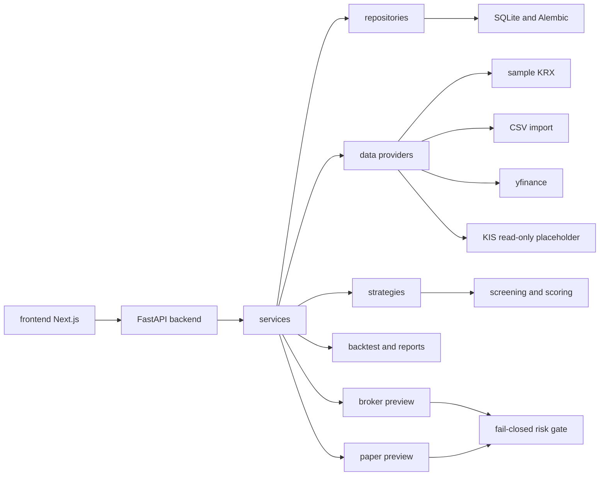
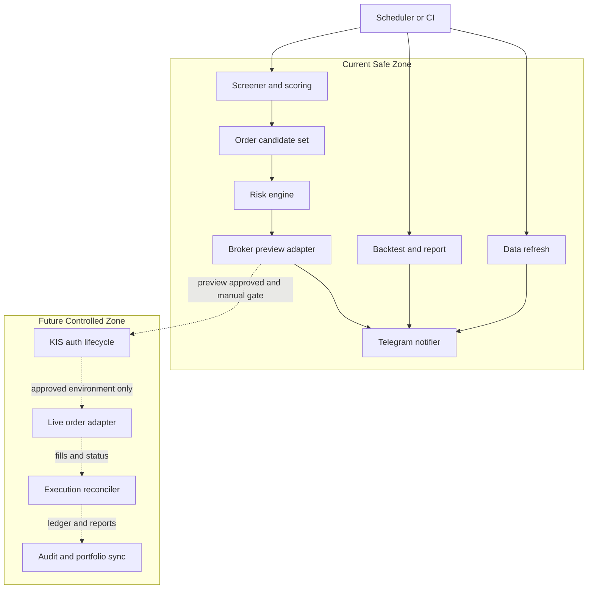

# jhonkim91 Stock-Analist-auto-trading 심층 분석 보고서

## 경영진 요약

이 저장소의 현재 성격은 **실거래 자동매매 엔진**이 아니라, **분석·스크리닝·백테스트·리포트·브로커 안전 스캐폴드**를 갖춘 보조형 MVP에 가깝습니다. 저장소의 현재 상태 문서는 `MVP v0.24.0`, `preview-only`, `fail-closed`, `실거래 미구현`을 명시하고 있으며, 최신 검증 문서는 2026-05-26 기준으로 백엔드 전체 테스트 293건 통과를 기록합니다. 백엔드/프론트엔드/CI 구조는 갖춰져 있지만, **실제 주문 전송, 주문 취소, 체결 처리, 웹소켓, 토큰 발급/갱신/캐시, 라이브 스케줄러**는 의도적으로 비활성 또는 미구현 상태입니다. citeturn13view1turn13view2turn14view0turn19view0

사용자 질의에 “한화투자(한투)”라고 표현되어 있으나, 저장소 내부 구현과 공식 문서 매칭 기준으로 현재 이 프로젝트가 겨냥하는 증권사 연동은 **`KIS`**, 즉 **한국투자증권 Open API**입니다. 저장소에는 `backend/app/api/kis.py`, `backend/app/services/kis_service.py`, `backend/config/data_sources.yaml`의 `provider_name: "kis"`가 존재하며, 공식 측의 개발자센터 역시 KIS Developers로 명시되어 있습니다. 따라서 보고서에서는 **“현재 저장소 기준 연동 대상은 한국투자증권 Open API”**로 해석하는 것이 정확합니다. citeturn23view0turn24view7turn29view2turn37search0turn37search1

핵심 판단은 세 가지입니다. 첫째, **한국 시장 지원은 상대적으로 깊고**, KRX 샘플/CSV/KIS 읽기 전용/시장 메타데이터 중심으로 설계되어 있습니다. 둘째, **미국 시장 지원은 현재 데이터 분석 수준에 가깝고**, `external_yfinance`가 `US`와 `KR`을 지원하지만 브로커 실행 연결은 없습니다. 셋째, **텔레그램 알림, 운영 가시성, 실거래 감시·통제 체계는 저장소에 아직 내장되지 않았으므로**, 이 부분은 설계와 구현이 모두 추가로 필요합니다. citeturn30view0turn20view0turn17view0turn16view2

현재 구조의 가장 큰 장점은 **안전성 중심의 보수적 설계**입니다. 브로커/페이퍼/토큰/네트워크 호출이 실질적으로 차단돼 있고, 브로커 프리뷰와 페이퍼 프리뷰는 모두 “deny + dry-run” 성격입니다. 그러나 이 설계는 동시에 **라이브 전환 준비도는 매우 낮다**는 뜻이기도 합니다. 라이브 거래로 확장하려면, 인증 수명주기, 시장 세션 제어, 주문 멱등성, 부분체결, 리스크 한도, 알림·감사 로그, 스테이징/프로덕션 분리, 환경별 승인 워크플로, 규제 기록 보존을 전부 새로 보강해야 합니다. citeturn22view0turn22view6turn24view7turn25view1turn26view0turn45search3turn45search4

아래 표는 현재 상태를 한눈에 요약한 것입니다. 관련 근거는 저장소 상태 문서, 검증 문서, 설정 파일, 공식 KIS/규제 문서에 기반합니다. citeturn13view1turn13view2turn29view2turn30view0turn45search3turn45search4

| 항목 | 현재 상태 | 판단 |
|---|---|---|
| 저장소 성숙도 | 분석·백테스트·리포트 중심 MVP | 실거래 전 단계 |
| KIS 연동 | status/config/validate 중심 읽기 전용 토대 | 인증·주문·웹소켓 미구현 |
| 한국 시장 | KRX 샘플/CSV/KIS 후보 소스 | 상대적으로 준비도 높음 |
| 미국 시장 | `external_yfinance` 데이터 지원 | 실행 어댑터 부재 |
| 브로커/페이퍼 | preview-only, deny, kill-switch 기본값 활성 | 안전 중심 |
| 테스트/CI | 백엔드 293 통과, 프론트 CI 존재 | 품질 기반은 양호 |
| Telegram | 전용 모듈/플로우 부재 | 신규 설계 필요 |
| 라이브 배포 준비도 | 낮음 | 스테이징·승인·감사 설계 필수 |

## 저장소 현황과 파일 매핑

저장소는 공개 저장소이며, 확인 시점 기준으로 `backend`, `frontend`, `docs`, `.github/workflows`, `AGENTS.md`, `Memory.md`, `README.md`, `requirements.txt`, `.env.example` 등이 루트에 존재합니다. FastAPI 백엔드와 Next.js 프론트엔드, 테스트, 문서, CI까지는 정리되어 있으나, 루트/README 기준으로 Dockerfile·compose 운용 문맥은 강하게 드러나지 않습니다. 또한 GitHub UI상 공개 저장소이며 이슈/PR/Actions 탭이 열려 있고, 별과 포크는 모두 0으로 표시됩니다. citeturn14view0turn15view0turn33view0

현재 기준의 “권위 있는 상태판”은 `README.md`보다 `docs/PROJECT_STATUS.md`와 `docs/VALIDATION.md`입니다. README의 설명은 여전히 KIS read-only, mock broker preview, preview-only 안전 스캐폴드를 잘 설명하지만, 최신 검증 문서는 더 앞선 체크포인트와 더 많은 테스트 수를 가리킵니다. 실무적으로는 **운영 상태 확인은 README보다 `PROJECT_STATUS.md`와 `VALIDATION.md`를 우선**하는 편이 맞습니다. citeturn8view0turn8view1turn13view1turn13view2

아래 표는 실무 관점에서 중요한 파일을 기준으로 역할과 현재 상태를 정리한 것입니다. 이 표는 저장소 트리, 상태 문서, 주요 코드 파일을 종합한 요약입니다. citeturn15view0turn17view0turn20view0turn16view1turn33view0turn35view5

| 경로 | 역할 | 현재 분석 포인트 |
|---|---|---|
| `README.md` | 사용자용 개요/실행 가이드 | KIS read-only, mock broker preview, 실거래 미구현 설명 |
| `AGENTS.md` | Codex/작업자 지침 | **실주문 금지**, **KIS 실제 호출 금지**, **시크릿 출력 금지**를 강하게 규정 |
| `Memory.md` | 최신 상태 요약 | 운영 메모 성격 |
| `docs/PROJECT_STATUS.md` | 현재 체크포인트 | `v0.24.0`, preview-only, fail-closed, live 미구현 |
| `docs/VALIDATION.md` | 최신 검증 기록 | 2026-05-26 기준 backend full pytest 293 passed |
| `docs/DB_MIGRATION.md` | Alembic/DB 정책 | ledger는 backtest/report artifact, live order 연결 아님 |
| `docs/research/phase-3e1-implementation-gap-and-codex-plan.md` | Codex 계획 문서 | goal.md는 없지만 Codex 분석·계획 형식이 이미 상세히 정의되어 있음 |
| `backend/app/main.py` | FastAPI 진입점 | router 등록, `/health`, CORS, 초기 DB/bootstrap |
| `backend/app/api/*.py` | API 라우터 | `kis`, `broker`, `paper`, `reports`, `backtest`, `screener` 등 분리 |
| `backend/app/services/*.py` | 핵심 비즈니스 로직 | KIS, broker, paper, risk, report, backtest, market session 등 |
| `backend/app/strategies/*.py` | 전략 구현 | momentum/darvas/new high/RS leader 등 |
| `backend/config/*.yaml` | 정책/전략/리스크/백테스트 설정 | 실행 모델과 한도는 대부분 YAML 중심 |
| `backend/tests/*.py` | 회귀·계약·리스크 테스트 | API, backtest, KIS read-only, broker safety, paper safety, strategies |
| `.github/workflows/ci.yml` | CI | backend pytest + frontend lint/typecheck/build |

백엔드 구조는 비교적 정석적입니다. `backend/app` 아래에 `api`, `core`, `models`, `repositories`, `services`, `strategies`, `utils`가 분리돼 있고, 진입점 `main.py`는 `backtest`, `broker`, `data`, `indicators`, `instruments`, `kis`, `market`, `paper`, `portfolio`, `reports`, `screener`, `settings` 라우터를 등록합니다. 이는 기능적으로 “데이터 → 스크리닝/전략 → 백테스트/리포트 → 브로커 프리뷰” 흐름을 잘 반영합니다. citeturn15view0turn17view0turn19view0

서비스 계층도 충분히 세분화되어 있습니다. `backtest_service.py`, `market_data_service.py`, `market_data_import_service.py`, `kis_service.py`, `broker_service.py`, `paper_trading_service.py`, `risk_service.py`, `report_service.py`, `market_session_service.py`, `scoring_service.py` 등이 별도 파일로 분리되어 있어 향후 확장 시 경계가 무너지지 않을 가능성이 높습니다. 즉, **구조 자체는 라이브 거래로 성장 가능한 형태**이지만, 현재 동작은 의도적으로 차단된 상태입니다. citeturn20view0

테스트 체계는 이 프로젝트의 강점입니다. 테스트 디렉터리에는 API 스모크, 백테스트, 데이터 품질, KIS read-only, 브로커 안전, 페이퍼 안전, KRX fixture contract, 전략, 포트폴리오 리스크, 레짐, 리포트 품질, Alembic migration 등이 포함되어 있습니다. 특히 파일명만 보아도 “기능 테스트”보다 “안전 계약 테스트”를 중시하는 설계가 드러납니다. citeturn16view1turn13view2

CI도 최소한의 품질 게이트는 이미 있습니다. 현재 `ci.yml`은 `push`와 `pull_request`에서 동작하고, `backend` 잡은 Python 3.12에서 `backend/tests` 전체를 실행하며, `frontend` 잡은 Node 22에서 `npm ci`, `lint`, `tsc --noEmit`, `build`를 수행합니다. 또한 백엔드 테스트 환경에서 `APP_ENV=test`와 `KIS_BROKER_KILL_SWITCH="1"`를 명시해 둔 점은 매우 실무적입니다. citeturn13view0turn14view0



## 한국투자 KIS 연동과 시장 지원

현재 저장소에서 구현된 증권사 연동은 **KIS read-only foundation**입니다. API 레벨에서는 `/api/kis/status`, `/api/kis/config`, `/api/kis/config/validate` 세 엔드포인트만 등록되어 있고, 서비스 레벨에서는 `KIS_APP_KEY`, `KIS_APP_SECRET` 환경변수의 존재·형식만 검사합니다. 반환값에는 `token_cache_enabled: false`, `broker_enabled: false`, `websocket_enabled: false`, `network_call_performed: false`, `token_issued: false`가 명시되어 있어, **지금은 인증 플로우도 실제 네트워크 호출도 하지 않는 상태**임이 매우 분명합니다. citeturn23view0turn24view1turn24view6turn24view7

이 점은 프로젝트 상태 문서와도 일치합니다. 상태 문서는 현재 범위 밖 항목으로 **실제 주문, 주문 취소, 체결, 계좌/잔고, websocket, live broker, KIS credential/token 저장, token 발급/refresh/cache, 실제 KIS API 호출, 실제 KRX/yfinance 네트워크 fetch**를 나열하고, `/api/kis/orders/*`, `/api/kis/broker/*`, `/api/kis/websocket/*`는 미등록 404를 유지한다고 명시합니다. 즉, KIS 흔적은 분명하지만 **라이브 브로커 어댑터는 아직 intentionally absent**입니다. citeturn22view0turn22view6turn22view7

공식 KIS Developers 문서를 보면 한국투자증권 Open API는 **REST와 WebSocket**을 제공하고, 국내주식뿐 아니라 해외주식에 대해서도 주문/계좌, 시세, 실시간 시세 카테고리를 공개합니다. 문서 메뉴에는 OAuth 인증, 국내주식 주문/계좌·기본시세·실시간시세, 해외주식 주문/계좌·기본시세·실시간시세가 모두 노출되어 있습니다. 또한 개발자센터 개요에는 모의투자용 REST 도메인 `openapivts.koreainvestment.com:29443`가 노출됩니다. 즉, **공식 플랫폼은 이미 KR/US와 실시간/주문 범위를 포괄**하지만, 저장소는 그 기능의 극히 일부만 “읽기 전용 토대”로 끌어온 상태입니다. citeturn37search0turn38search2turn41view0turn42view0

인증 수명주기 또한 현재 저장소와 공식 플랫폼 사이의 중요한 간극입니다. 저장소는 토큰 발급·갱신을 구현하지 않았습니다. 반면 공식 문서는 OAuth 접근토큰 발급 API와 토큰 만료 절차를 제공하며, 문서 노출 기준으로 개인 Open API 쪽 접근토큰 소개와 별도로 제휴 API 쪽에는 90일 만료 절차가 안내됩니다. 즉, **KIS 토큰 수명은 사용 시나리오에 따라 문맥이 다르며**, 저장소는 아직 이 차이를 캡슐화하지 않았습니다. 따라서 실제 구현 단계에서는 `개인 Open API`와 `제휴 API`를 혼동하지 않는 인증 추상화가 반드시 필요합니다. citeturn38search10turn38search1turn38search3

데이터 소스 관점에서 보면 한국 시장과 미국 시장의 지원 강도가 확연히 다릅니다. `data_sources.yaml`에는 `sample_krx`, `csv_krx`, `krx_index_sector`, `krx_symbol_master`, `krx_trading_calendar`, `kis_market_data`, `external_yfinance`가 등록되어 있습니다. 이 중 `kis_market_data`는 `supported_markets: ["KR"]`, `market: "KR"`, `venue: "KRX"`로 설정돼 있고, `external_yfinance`는 `supported_markets: ["US", "KR"]`입니다. 따라서 **저장소 자체 기준으로는 한국 시장이 1급 시민이고, 미국 시장은 yfinance 기반 데이터 수준의 지원만 존재**한다고 보는 것이 맞습니다. citeturn30view0turn29view2

브로커 설정 파일과 서비스 구현도 같은 결론을 가리킵니다. `broker.yaml`은 `provider_name: "kis"`, `provider_type: "broker_placeholder"`, `enabled: false`, `network_enabled: false`, `can_submit: false`, `preview_only: true`, `kill_switch_enabled: true`로 되어 있습니다. 실제 `broker_service.preview_order()`는 `preview_id`만 생성하고, `can_submit: false`, `order_created: false`, `network_call_performed: false`, `adapter_order_call_performed: false`, `adapter_network_call_performed: false`를 반환합니다. 이것은 주문 프리뷰의 껍데기만 만든 **브로커 안전 스캐폴드**입니다. citeturn31view2turn31view1turn25view1turn25view3turn25view5turn25view6

실무 해석은 명확합니다. **현재 저장소의 KIS 통합 수준은 “연동 여부/설정 여부를 안전하게 보여주는 단계”**이며, 아직 “시장 데이터 풀링 → 토큰 관리 → 주문 전송 → 체결 반영 → 계좌 동기화”로 이어지는 브로커 라이프사이클은 없습니다. 따라서 요청하신 “정확한 한투 API 엔드포인트와 자격증명”은 저장소 내에서 지정돼 있지 않고, 현재 진입 가능한 공식 문서 범위에서도 이 보고서에 필요한 수준으로 개별 엔드포인트/TR ID를 모두 고정하여 추출하진 않았습니다. 이 항목은 **현재 저장소 기준 미지정**으로 보는 것이 맞습니다. citeturn23view0turn24view7turn29view2turn37search0turn38search2

아래 표는 “현재 저장소 구현 수준”과 “공식 KIS 플랫폼 가능 범위”의 차이를 요약한 것입니다. 관련 근거는 저장소 KIS/broker 코드와 공식 KIS Developers 문서에 있습니다. citeturn23view0turn24view7turn31view2turn37search0turn38search2turn41view0turn42view0

| 항목 | 현재 저장소 | 공식 플랫폼 범위 | 평가 |
|---|---|---|---|
| 인증 | 환경변수 존재/형식 검증만 수행 | OAuth 접근토큰 발급/폐기/갱신 문서 존재 | 큰 갭 |
| 국내 시세 | KIS는 KR daily OHLCV 후보 소스 수준 | 국내 시세·실시간 시세·주문 API 폭넓음 | 부분 구현 |
| 해외 시세 | 공식 KIS 연동 없음, yfinance 위주 | 해외주식 시세·실시간·주문 문서 존재 | 미구현 |
| 주문 | preview-only, submit 금지 | 국내/해외 주문 API 존재 | 미구현 |
| WebSocket | false | 공식 WebSocket 지원 | 미구현 |
| 모의/실전 분리 | 저장소는 fail-closed placeholder | 공식 문서에 모의투자 도메인 존재 | 설계만 필요 |
| 토큰 캐시 | 비활성 | 공식 만료/갱신 절차 존재 | 미구현 |

## 전략, 백테스트, 리스크 통제와 실행 고려사항

전략 레이어는 생각보다 충실합니다. 전략 디렉터리에는 `canslim_lite`, `darvas_box`, `momentum_rank`, `new_high_breakout`, `pullback_20ema`, `relative_strength_leader`, `stage_analysis_weekly`, `registry`가 들어 있으며, 상태 문서에는 `new_high_breakout`이 기본 전략이고 `momentum_rank`, `relative_strength_leader`, `darvas_box` 등이 available-only 전략으로 관리된다고 적혀 있습니다. 즉, **전략 실험과 스크리닝 설명 가능성은 이미 MVP 수준 이상**입니다. citeturn18view1turn13view1

백테스트 엔진 설정도 단순 장난감 수준은 아닙니다. `backtest.yaml`은 `execution.mode: "next_open"`, `same_bar_stop_first: true`, `commission_bps: 2.0`, `slippage_bps: 5.0`, `max_holding_days: 30`, `max_participation_rate: 0.05`, `min_fill_ratio: 0.25`, `allow_partial_fill: true`, `rebalance_frequency: "daily"`, `weighting: "equal_risk"`를 둡니다. 상태 문서 역시 gap-aware stop/target, liquidity and partial-fill simulation을 Phase 3G 성과로 기재하고 있습니다. 따라서 이 프로젝트의 핵심 강점은 **“실행 전 실제성 있는 백테스트 방향”**이지, “라이브 주문 엔진”이 아닙니다. citeturn32view5turn13view1

리스크 설정도 YAML 기반으로 일관됩니다. `risk.yaml`에는 `risk_fraction: 0.01`, `max_position_fraction: 0.2`, `max_open_positions: 5`, `max_daily_loss_fraction: 0.03`, `max_symbol_exposure_fraction: 0.2`, `max_sector_exposure_fraction: 0.4`, `max_strategy_exposure_fraction: 0.5`, `gap_risk_fraction: 0.08`, `atr_stop_multiple: 2.0`, `hard_stop_pct: 0.08`, `target_reward_risk: 2.5`가 정의되어 있습니다. 별도로 `broker.yaml`은 short sell 금지, preview 허용, 최대 수량/최대 명목 한도, sanitize audit를 둡니다. 이는 **리스크 예산과 주문 게이트를 명시적으로 파일화했다**는 점에서 좋은 출발점입니다. citeturn31view9turn31view2turn31view0

다만 현재 리스크 통제는 어디까지나 **“실행 차단용”**입니다. 브로커 프리뷰는 항상 `can_submit: false`, kill switch 차단, 네트워크 호출 없음, 실제 주문 미생성을 반환합니다. 페이퍼 프리뷰도 `can_create: false`, `can_simulate_fills: false`, `paper_order_created: false`, `position_changed: false`, `paper_tables_write_enabled: false`를 유지합니다. 따라서 지금의 리스크 게이트는 라이브 제출 직전의 정교한 주문 승인체계라기보다, **실행 금지 상태를 깨지 않기 위한 회귀 방지 장치**에 가깝습니다. citeturn25view1turn25view3turn25view5turn26view0turn26view1turn26view3turn26view4

데이터 소스는 **KRX 샘플/CSV**, **외부 yfinance**, **KIS KR daily OHLCV 후보**, **KRX fixture 기반 레퍼런스 데이터**로 구성됩니다. `data_providers.py`는 yfinance provider를 별도 클래스로 두고 `network_enabled`가 false이면 호출을 막습니다. 동시에 KRX fixture schema validation 함수군이 매우 상세하게 존재합니다. 이 조합은 “실시간 체결 최적화”보다 **데이터 품질 방어와 계약 기반 검증**을 우선한 설계라고 보는 편이 맞습니다. citeturn30view0turn27view2turn27view6

실행 지연과 체결 품질 측면의 한계도 분명합니다. 현재 엔진은 일봉 중심, 다음 거래일 시가 체결 가정, 부분체결·슬리피지의 시뮬레이션 수준까지는 가지만, 실제 브로커 라우팅·시장 미세구조·호가단위·웹소켓 지연·재연결·주문 정정/취소·중복주문 방지·세션 컷오프를 다루지 않습니다. 공식 KIS는 WebSocket과 국내/해외 주문·실시간 시세를 제공하지만, 저장소 상태 문서는 실제 websocket과 live broker를 아직 범위 밖으로 둡니다. 그러므로 **현재 구조로는 저지연/실시간 자동매매를 바로 주장할 수 없습니다.** citeturn32view5turn22view0turn37search14turn38search2turn42view0

운영 가시성도 최소 수준입니다. `main.py`에는 `/health` 엔드포인트만 있으며, 공개 파일 트리 기준 별도의 metrics/tracing/alerting 모듈은 확인되지 않습니다. 상태·검증 문서가 품질 관리 역할을 일부 대신하지만, 실거래 단계에서 필요한 **주문 상관관계 ID, 토큰 상태, 데이터 지연(ms), 라우팅 실패율, 리스크 게이트 히트 수, 알림 재시도 수, 사용자 승인 로그**는 아직 저장소의 1급 개념이 아닙니다. 이 부분은 라이브 전환 전에 반드시 보강해야 합니다. citeturn19view0turn15view0turn20view0turn13view2

아래 표는 현재 리스크/실행 요소를 실무 관점으로 재정리한 것입니다. 저장소 설정값과 서비스 동작을 근거로 한 요약입니다. citeturn31view9turn31view2turn32view5turn25view1turn26view0

| 영역 | 현재 구현 | 해석 |
|---|---|---|
| 포지션 리스크 | 포지션/섹터/전략/일손실 한도 존재 | 리스크 예산 정의는 양호 |
| 브로커 게이트 | short sell 금지, 수량/명목 한도, kill switch | 실행 차단 중심 |
| 페이퍼 트레이딩 | preview만 존재, create/simulate false | 실운용 페이퍼 계정 아님 |
| 백테스트 체결 | next-open, commission/slippage, partial fill | 연구용 현실성 반영 |
| 데이터 품질 | CSV validation, KRX fixture contract, summary | 데이터 방어 강점 |
| 관측 가능성 | `/health` 중심 | 운영 메트릭/경보 부족 |

## 텔레그램 리포트와 운영 가시성 설계

현재 공개된 대표 파일 구조와 문서 기준으로는 **Telegram 전용 API, notifier service, scheduler, template 모듈**이 보이지 않습니다. `backend/app/api`, `backend/app/services`, `frontend/app`, `frontend/lib`, README/상태 문서의 대표 노출 범위를 종합해 보면, 텔레그램 연동은 “현재 구현 기능”이 아니라 “추가해야 할 운영 기능”입니다. 따라서 이 영역은 **현황 보고**보다는 **실행 가능한 설계 제안**으로 보는 것이 맞습니다. citeturn17view0turn20view0turn16view2turn16view3turn8view0turn13view1

Telegram Bot API는 메시지 포맷 면에서는 충분히 강력합니다. 공식 문서는 `bold`, `italic`, `underline`, `strikethrough`, `spoiler`, `blockquote`, `inline link`, `pre-formatted code` 등을 지원하고, `reply_markup`으로 인라인 키보드나 사용자 액션 버튼을 붙일 수 있다고 설명합니다. 즉, 텔레그램은 “실시간 트레이드 알림”보다도 **운영 리포트/승인 안내/리스크 경보/프리뷰 링크 전달**에 매우 적합합니다. citeturn47view2

다만 스케줄링은 텔레그램이 아니라 외부 오케스트레이션이 맡는 것이 자연스럽습니다. 텔레그램 문서는 메시지 형식과 상호작용 UI를 설명할 뿐이고, 저장소도 현재 스케줄러를 내장하지 않습니다. 따라서 정시 발송은 GitHub Actions 스케줄 워크플로, 서버 크론, 혹은 별도 잡 러너가 담당하고, 텔레그램은 결과 전달 채널로 두는 편이 가장 안전합니다. 이 판단은 텔레그램 공식 문서와 현재 저장소 구조를 바탕으로 한 설계적 추론입니다. citeturn47view2turn14view0turn13view1

아래 표는 실무적으로 바로 쓸 수 있는 Telegram 리포트 시나리오입니다. 공식 Bot API의 포맷 기능과 현재 저장소의 프리뷰·리포트 성격을 반영해 설계했습니다. citeturn47view2turn13view1turn25view1turn26view0

| 시나리오 | 트리거 | 핵심 필드 | 권장 우선순위 |
|---|---|---|---|
| 장 시작 전 준비 리포트 | 영업일 개장 전 | 데이터 최신 시각, 장 상태, 리스크 한도, kill switch 상태 | 높음 |
| 스크리너 결과 요약 | 스크리너 완료 후 | 통과 종목 수, 상위 후보, 전략명, 실패 조건 요약 | 높음 |
| 브로커 프리뷰 결과 | 주문 프리뷰 생성 시 | symbol/side/qty/venue/session/risk_gate/reason_codes | 매우 높음 |
| 일간 포트폴리오 리포트 | 장 마감 후 | 총자산, 손익, 최대낙폭, 상위 기여/손실 종목 | 높음 |
| 데이터 품질 경보 | import/validation 실패 시 | source_id, 오류 수, 영향 범위, 재시도 여부 | 매우 높음 |
| CI 실패 알림 | push/PR CI 실패 시 | branch, commit, failed job, failed test summary | 중간 |
| 배포 승인 요청 | staging/prod 배포 전 | 환경명, commit SHA, 최신 검증 결과, 승인 링크 | 중간 |
| 라이브 리스크 이벤트 | 일손실·노출 한도 초과 시 | 한도 항목, 현재 값, 자동 차단 여부 | 최상 |

아래는 바로 적용 가능한 메시지 템플릿 예시입니다. Telegram은 HTML 스타일 포맷을 지원하므로, 운영 메시지를 **짧고 강하게** 유지하는 편이 좋습니다. 포맷 근거는 공식 Bot API 문서에 있습니다. citeturn47view2

```text
<b>[장 시작 전 준비 상태]</b>
- date: 2026-05-27
- market: KR
- session: PREOPEN
- data_freshness: OK (09:00 KST 기준)
- kill_switch: ON
- live_submit: DISABLED
- top_strategy: new_high_breakout
- candidates: 12
- note: 현재 시스템은 preview-only 입니다.
```

```text
<b>[브로커 프리뷰]</b>
- symbol: 005930
- side: buy
- qty: 10
- venue: KRX
- session: REGULAR
- can_submit: false
- preview_only: true
- risk_gate: DENY
- reason_codes:
  - KILL_SWITCH_ACTIVE
  - BROKER_PREVIEW_ONLY
```

```text
<b>[일간 포트폴리오 리포트]</b>
- equity: 101,240,000 KRW
- daily_pnl: +1.24%
- max_drawdown: -4.2%
- exposure:
  - gross: 38%
  - sector_max: 18%
- winners: 3
- losers: 2
- rebalance: 완료
- report_id: rpt-20260527-001
```

```text
<b>[데이터 품질 경보]</b>
- source_id: external_yfinance
- severity: ERROR
- issue_count: 17
- impact: screener/backtest 지연
- action: KRX CSV fallback 사용
- retry: 1/3
```

운영 가시성 측면에서 Telegram은 단순 알림보다 **“운영 요약”과 “조치 지점”**을 같이 보내야 효과가 큽니다. 따라서 각 메시지에는 최소한 `run_id`, `strategy`, `market`, `data_as_of`, `risk decision`, `next action`을 묶어 보내는 것을 권장합니다. 추가로 인라인 키보드로 “리포트 보기”, “프리뷰 열기”, “CI 보기”, “배포 승인 페이지 열기”를 넣으면 운영 편의성이 크게 좋아집니다. citeturn47view2turn14view0

## 개선 아키텍처와 구현 우선순위

제가 보기에 이 저장소의 다음 단계는 “실거래 기능 추가”가 아니라 **운영 가능성을 확보하는 준비 단계**여야 합니다. 현재 구조가 이미 안전 계약을 강하게 내장하고 있으므로, 이를 깨지 않고 확장하려면 **P0: 관측성·문서화·goal.md 자동생성**, **P1: Telegram/스테이징/페이퍼 영속화**, **P2: KIS read-only 고도화와 시장 분리**, **P3: 승인형 라이브 어댑터** 순서가 가장 안전합니다. 이는 저장소의 자체 Codex 계획 문서가 “실주문 금지, token/cache 금지, Phase 3D safety contract 유지”를 반복해서 강조하는 방향과도 일치합니다. citeturn35view5turn33view0turn13view1

아래 아키텍처는 **현재 저장소를 해치지 않으면서** 라이브 전환 준비도를 올리는 권장 구조입니다. 실거래 어댑터는 맨 마지막 단계로 밀고, 그 전 단계에서는 계속 preview/paper/read-only를 유지하는 방식입니다. 이 설계는 저장소 구조와 공식 KIS 플랫폼 범위를 맞춰 재배치한 것입니다. citeturn15view0turn20view0turn37search0turn42view0



우선순위는 다음과 같이 잡는 것이 좋습니다. 아래 테이블은 저장소 현황과 공식 문서, 규제 요구를 모두 반영한 실행 계획입니다. citeturn13view1turn13view2turn35view5turn45search3turn45search4

| 우선순위 | 작업 | 목적 | 수정될 가능성이 큰 파일 |
|---|---|---|---|
| P0 | `goal.md` 자동생성기 추가 | 현재 상태·안전 계약·다음 작업을 기계적으로 정리 | `scripts/`, `.github/workflows/`, `docs/` |
| P0 | observability 기본층 추가 | 구조화 로그, run_id, alert hook, data freshness | `backend/app/core`, `services`, `api/reports.py` |
| P0 | Telegram notifier 추가 | 프리뷰/리포트/CI 결과 전달 | `backend/app/services/telegram_notifier.py` 신규 |
| P1 | paper 전용 영속화 테이블 추가 | preview와 실제 paper 실행 분리 | `models/tables.py`, Alembic, `paper_trading_service.py` |
| P1 | 시장 추상화 정리 | KR/KRX/KIS와 US/yfinance를 명확히 분리 | `data_sources.yaml`, `data_providers.py`, `market_session_service.py` |
| P1 | 스테이징 환경 분리 | sandbox/read-only/live를 config로 격리 | `broker.yaml`, env schema, CI/CD |
| P2 | KIS read-only network adapter | status/config/validate를 넘어 실제 read-only 시세 확인 | `kis_service.py`, contract tests |
| P2 | 실시간 세션/캘린더 고도화 | 장 상태, 휴장일, 시장별 cutoff 제어 | `market_session_service.py`, KRX fixture |
| P3 | 승인형 live adapter | 환경 승인과 kill switch 조건 하에서만 제한적 submit | 신규 `execution_adapter` 계층 |

리스크 평가는 냉정해야 합니다. 저장소는 현재 안전하지만, 라이브로 가면 리스크의 종류가 달라집니다. 특히 미국 규제 측면에서는 SEC Rule 15c3-5가 시장 접근을 제공하는 브로커-딜러에게 **오류 주문 방지, 신용/자본 한도, 규제 준수용 위험 통제**를 요구하고, FINRA는 알고리즘 전략에 대해 **written supervisory procedures, 개발·테스트·배포·변경 통제, 책임자 지정**을 강조합니다. 한국 측에서도 금융위원회가 자본시장 불공정거래 별도 메뉴와 신고 체계를 운영하는 만큼, 실거래 시스템은 전략 성능보다 먼저 **내부통제·시장질서 준수**를 우선해야 합니다. citeturn45search3turn45search12turn45search4turn45search10turn47view0

아래 표는 주요 실패 모드와 대응을 정리한 것입니다. 앞부분은 현재 저장소에서 이미 적용된 부분이고, 뒷부분은 라이브 전환 전에 추가해야 할 통제입니다. citeturn22view0turn24view7turn25view1turn26view0turn45search3turn45search4

| 실패 모드 | 현재 완화책 | 잔여 위험 | 권장 추가 통제 |
|---|---|---|---|
| 잘못된 자격증명 | 형식/존재만 검증, 네트워크 금지 | 실제 인증 실패를 아직 모름 | token lifecycle 상태머신, 비밀관리시스템 연동 |
| 장 종료/휴장일 오동작 | preview session metadata | 라이브 세션 미검증 | 거래소 캘린더 동기화, 시장별 cutoff |
| 중복 주문/재시도 | 현재는 submit 금지라 위험 없음 | 라이브 전환 시 치명적 | client_order_id, 멱등성 키, outbox |
| 호가 급변/유동성 부족 | backtest에 partial fill 가정 | 실거래 체결 품질 미측정 | 실시간 호가 기준 가격 보호폭 |
| 토큰 만료 | 발급 자체 없음 | 라이브 시 장애 | proactive refresh, expiry-aware cache |
| 시크릿 유출 | 문서/로그/API 응답 금지 규칙 | CI/운영 중 유출 가능 | GitHub environment secrets, OIDC, redaction |
| 웹소켓 무한 재연결 | 현재 미구현 | 추후 차단 가능성 | backoff, reconnect budget, circuit breaker |
| 전략 폭주 | preview-only | 라이브 시 손실 확산 | 일손실 한도, 포지션 정지, 전량 차단 |

시험 계획은 현재 테스트 자산을 바탕으로 확장하면 됩니다. 지금 있는 테스트 파일만 봐도 기능 범주가 잘 나뉘어 있으므로, 향후에는 **단위 테스트 → 계약 테스트 → 통합 테스트 → 스테이징 read-only → paper shadow run → 라이브 canary** 순으로 문턱을 세우는 것이 좋습니다. 최신 검증 기록과 Codex 계획 문서도 같은 방향을 암시합니다. citeturn16view1turn13view2turn35view5

아래는 권장 테스트 매트릭스입니다. citeturn16view1turn13view2turn38search2turn45search4

| 단계 | 목적 | 대표 범위 | 통과 기준 |
|---|---|---|---|
| Unit | 계산 로직 검증 | indicators, scoring, regime, risk math | 결정론적 결과 |
| Contract | 외부 스키마 방어 | KRX fixture, KIS response normalization | schema drift 0 |
| Integration | 서비스 간 경계 검증 | screener→backtest→report, broker preview | side effect 없는 성공 |
| API smoke | 공개 계약 검증 | `/health`, `/api/kis/*`, `/api/broker/*` | route/response 안정 |
| Staging read-only | 외부 연동 검증 | KIS status/config/read-only quote | 주문 없음 |
| Paper shadow | 전략 운영 검증 | 실시간 후보 생성, 알림, paper ledger | 실제 손익 계산 일치 |
| Live canary | 제한 배포 | 소액·단일 전략·단일 시장 | 승인된 환경에서만 수행 |

## CI, Codex 자동화와 안전 배포 체크리스트

현재 CI는 이미 좋은 출발점입니다. GitHub Actions 워크플로는 `push`와 `pull_request`에서 `main` 브랜치를 대상으로 실행되고, 권한은 `contents: read`로 최소화되어 있습니다. 이어서 backend pytest와 frontend lint/typecheck/build가 나뉘어 수행됩니다. 즉, **현재 저장소는 “코드 품질 게이트”는 있으나 “운영 자동화 게이트”는 아직 없다**고 보는 것이 정확합니다. citeturn13view0turn14view0

GitHub Actions 공식 문서는 시크릿을 repository/environment/organization 수준에서 관리할 수 있고, environment를 사용하는 잡은 보호 규칙을 통과해야만 해당 secrets에 접근할 수 있으며, required reviewers를 둘 수 있다고 설명합니다. 또한 `GITHUB_TOKEN`은 워크플로에서 명시적으로 사용하는 권한만 부여하는 방식으로 최소권한 설계를 지원합니다. 따라서 이 저장소는 앞으로 **`stage` / `prod-readonly` / `prod-live` 환경 분리**를 반드시 도입해야 합니다. citeturn43search2turn43search5turn43search8turn44search1turn44search3turn44search4turn44search6

OpenAI의 공식 Codex 문서 기준으로 Codex는 코드 작성·이해·리뷰·디버깅·반복 작업 자동화에 적합하며, **Codex CLI**는 로컬 터미널에서 코드 읽기/수정/실행을 할 수 있고, **Codex cloud**는 클라우드 환경에서 병렬/백그라운드 작업을 맡길 수 있습니다. 따라서 이 프로젝트의 자동화는 “GitHub Actions가 컨텍스트를 정리하고 goal.md를 만들고, 승인된 단계에서 Codex가 계획/패치/리뷰를 수행한 뒤, 다시 CI가 검증”하는 구조가 가장 잘 맞습니다. 다만 이 보고서 범위에서 **GitHub Actions 내부에서 Codex를 완전 무인 M2M 방식으로 호출하는 상세 공식 실행 사양은 명확히 고정하지 못했으므로**, 실무 구현은 `Codex CLI + 보안된 self-hosted runner` 또는 `Codex cloud + 인간 승인` 방식 중 하나로 잡는 것이 안전합니다. citeturn47view3turn43search7turn43search13turn43search22turn43search19

아래는 권장 자동화 흐름입니다. 현재 CI를 해치지 않고 `goal.md` 생성과 Codex 단계를 붙이는 방식입니다. citeturn13view0turn35view5turn47view3turn44search1

```mermaid
flowchart LR
    A[push or manual dispatch] --> B[CI tests]
    B --> C[repo state analyzer]
    C --> D[generate goal.md]
    D --> E[upload artifact or commit branch]
    E --> F[human review gate]
    F --> G[Codex analysis or patch generation]
    G --> H[PR creation]
    H --> I[CI re-run]
    I --> J[staging readonly]
    J --> K[paper shadow run]
    K --> L[prod-live approval]
```



`goal.md`는 지금 저장소에 없지만, 사실상 그 원형은 이미 존재합니다. `AGENTS.md`와 `docs/research/phase-3e1-implementation-gap-and-codex-plan.md`는 Codex가 따라야 할 금지사항, 분석 순서, 계획 포맷, 안전 계약 점검 체크리스트를 매우 상세히 정의합니다. 따라서 완전히 새로운 문서를 발명할 필요가 아니라, **현재 문서들을 모아 표준 goal.md로 정규화하면 됩니다.** citeturn33view0turn35view5

권장하는 `goal.md` 생성 절차는 다음과 같습니다. 이 절차는 저장소의 문서 구조와 현재 CI를 그대로 활용하는 방식입니다. citeturn33view0turn13view1turn13view2turn35view5

1. `README.md`, `AGENTS.md`, `Memory.md`, `docs/PROJECT_STATUS.md`, `docs/VALIDATION.md`, `docs/research/phase-3e1-implementation-gap-and-codex-plan.md`, `backend/config/*.yaml`을 파싱합니다.  
2. 현재 브랜치/커밋/dirty state를 수집합니다.  
3. 안전 계약 항목을 자동 체크합니다. 예: `preview_only`, `order_created=false`, `token_issued=false`, `/api/kis/orders/*` route 부재, `kill_switch_enabled=true`.  
4. 테스트 명령을 현재 문서 기준으로 주입합니다.  
5. 결과를 `goal.md`로 렌더링하고 artifact로 보관하거나 별도 브랜치에 커밋합니다.  
6. 승인된 경우에만 Codex가 `goal.md`를 읽고 계획 또는 패치를 생성하게 합니다.  
7. 생성된 PR은 기존 CI와 stage 환경 검증을 통과한 뒤에만 병합합니다.  

아래는 바로 적용 가능한 `goal.md` 골격 예시입니다. 이 형식은 저장소의 existing Codex plan 문서 포맷과 잘 맞습니다. citeturn35view5turn33view0

```markdown
# goal.md

## Current State
- repo: jhonkim91/Stock-Analist-auto-trading
- checkpoint: MVP v0.24.0
- mode: preview-only, fail-closed
- latest_validation_date: 2026-05-26

## Safety Contract
- broker preview does not create orders
- KIS order/broker/websocket routes stay unregistered
- token issuance/refresh/cache stay disabled unless explicitly approved
- secrets must not be exposed in logs, docs, or API responses

## Scope
- include:
  - observability
  - telegram notifier
  - goal generator
  - paper persistence foundation
- exclude:
  - live submit
  - real KIS order routing
  - websocket execution
  - secret printing

## Required Evidence
- backend pytest pass
- frontend lint/typecheck/build pass
- route safety smoke pass
- secret scan pass

## Tasks
- task_id:
- objective:
- files_to_modify:
- implementation_detail:
- tests:
- safety_impact:
- rollback_plan:
```

아래는 GitHub Actions에 붙일 수 있는 예시 워크플로입니다. 이 코드는 **goal.md 생성 자동화**와 **환경별 승인 게이트**를 포함한 샘플이며, 현재 저장소의 CI 스타일을 크게 벗어나지 않습니다. 관련 시크릿/환경 승인 모델은 GitHub 공식 문서를, Codex 단계의 제품 성격은 OpenAI 공식 문서를 근거로 삼았습니다. citeturn43search2turn43search8turn44search1turn44search3turn47view3

```yaml
name: Planning and Safe Automation

on:
  workflow_dispatch:
  push:
    branches: [main]

permissions:
  contents: write
  pull-requests: write

jobs:
  test:
    name: Test and Build
    runs-on: ubuntu-latest
    permissions:
      contents: read
    steps:
      - name: 코드 체크아웃
        uses: actions/checkout@v4

      - name: 파이썬 설정
        uses: actions/setup-python@v5
        with:
          python-version: "3.12"

      - name: 백엔드 의존성 설치
        run: |
          python -m pip install --upgrade pip
          python -m pip install -r requirements.txt

      - name: 백엔드 테스트
        env:
          APP_ENV: test
          KIS_BROKER_KILL_SWITCH: "1"
        run: python -m pytest backend/tests

      - name: 노드 설정
        uses: actions/setup-node@v4
        with:
          node-version: "22"
          cache: npm
          cache-dependency-path: frontend/package-lock.json

      - name: 프론트 설치 및 빌드
        working-directory: frontend
        env:
          NEXT_PUBLIC_API_BASE_URL: http://localhost:8000
        run: |
          npm ci
          npm run lint
          npm exec tsc -- --noEmit
          npm run build

  generate-goal:
    name: Generate goal.md
    needs: test
    runs-on: ubuntu-latest
    steps:
      - name: 코드 체크아웃
        uses: actions/checkout@v4

      - name: goal.md 생성
        run: |
          python scripts/generate_goal.py

      - name: 산출물 업로드
        uses: actions/upload-artifact@v4
        with:
          name: goal-md
          path: goal.md

  codex-plan:
    name: Codex Plan
    needs: generate-goal
    runs-on: self-hosted
    environment: stage
    steps:
      - name: 코드 체크아웃
        uses: actions/checkout@v4

      - name: goal.md 다운로드
        uses: actions/download-artifact@v4
        with:
          name: goal-md

      - name: Codex CLI 실행
        run: |
          codex -i goal.md "AGENTS.md를 준수하여 계획만 작성하고 PR 초안을 생성하라."
```

필요 권한과 환경 변수는 “현재 저장소에 실제로 확인된 것”과 “라이브 전환을 위해 추가가 필요한 것”을 나눠 관리하는 편이 안전합니다. 저장소 코드/CI에서 확인되는 값은 `APP_ENV`, `KIS_BROKER_KILL_SWITCH`, `KIS_APP_KEY`, `KIS_APP_SECRET`, `PAPER_TRADING_KILL_SWITCH`, `NEXT_PUBLIC_API_BASE_URL`입니다. 이외 라이브용 값은 현재 저장소에 **미지정**이므로, 아래 표에서는 `제안`으로 분리합니다. citeturn13view0turn24view7turn26view0turn33view0

| 구분 | 이름 | 상태 | 비고 |
|---|---|---|---|
| 현재 확인 | `APP_ENV` | 확인 | CI 테스트 환경 |
| 현재 확인 | `KIS_BROKER_KILL_SWITCH` | 확인 | CI에서 강제 활성 |
| 현재 확인 | `KIS_APP_KEY` | 확인 | KIS 설정 검증에 사용 |
| 현재 확인 | `KIS_APP_SECRET` | 확인 | KIS 설정 검증에 사용 |
| 현재 확인 | `PAPER_TRADING_KILL_SWITCH` | 확인 | paper create/simulate 차단 |
| 현재 확인 | `NEXT_PUBLIC_API_BASE_URL` | 확인 | 프론트 API 연결 |
| 제안 | `TELEGRAM_BOT_TOKEN` | 제안 | Telegram notifier |
| 제안 | `TELEGRAM_CHAT_ID` | 제안 | 운영 채널 분리 |
| 제안 | `KIS_ENV` | 제안 | `readonly` / `paper` / `live` |
| 제안 | `KIS_BASE_URL` | 제안 | exact endpoint는 현재 저장소 기준 미지정 |
| 제안 | `KIS_WS_URL` | 제안 | exact endpoint는 현재 저장소 기준 미지정 |
| 제안 | `KIS_ACCOUNT_NO` | 제안 | 계좌번호는 절대 로그 금지 |
| 제안 | `KIS_PRODUCT_CODE` | 제안 | 국내/해외 계좌 구분용 |
| 제안 | `ENABLE_LIVE_SUBMIT` | 제안 | 기본값 false |
| 제안 | `ORDER_IDEMPOTENCY_PREFIX` | 제안 | 중복 방지 |
| 제안 | `OTEL_EXPORTER_OTLP_ENDPOINT` | 제안 | 운영 가시성 |
| 제안 | `ALERT_LEVEL_MIN` | 제안 | 경보 노이즈 제어 |

마지막으로, 안전한 라이브 배포 체크리스트는 아래처럼 가져가는 것을 권장합니다. 이 목록은 저장소의 안전 계약, GitHub Actions 환경 보호, 미국 쪽 시장접근 리스크 통제 가이던스를 함께 반영한 것입니다. citeturn33view0turn22view0turn43search2turn44search1turn44search3turn45search3turn45search4

- `prod-live` 환경은 **required reviewers** 없이는 실행되지 않게 설정합니다.  
- `prod-live` secrets는 repository secrets가 아니라 **environment secrets**로 분리합니다.  
- `ENABLE_LIVE_SUBMIT` 기본값은 `false`로 두고, 승인된 배포에서만 `true`를 주입합니다.  
- `KIS_BROKER_KILL_SWITCH`와 `PAPER_TRADING_KILL_SWITCH`는 **기본 ON**으로 유지합니다.  
- 라이브 전 단계로 `prod-readonly`와 `paper-shadow` 환경을 반드시 거칩니다.  
- 모든 주문에는 멱등성 키와 run_id를 부여합니다.  
- 주문 전 리스크 게이트에서 일손실·포지션·섹터·전략·명목 한도를 다시 점검합니다.  
- 로그, 알림, API 응답, 문서에 account/token/secret/raw header를 남기지 않습니다.  
- 장애 시 되돌릴 수 있도록 “kill switch → scheduler stop → notifier only mode” 순서의 롤백 경로를 문서화합니다.  
- 라이브 전환 후에도 `/health`만으로는 부족하므로, 데이터 지연/토큰 만료/주문 실패/부분체결/재시도 수를 별도 메트릭으로 수집합니다.  

종합하면, 이 저장소는 **“실전 자동매매 직전의 안전한 연구 플랫폼”**으로는 상당히 잘 정리돼 있습니다. 그러나 **라이브 트레이딩 시스템**으로 보기에는 아직 의도적으로 비워 둔 층이 많습니다. 따라서 가장 현실적인 다음 단계는 `goal.md` 표준화, Codex 분석 자동화, Telegram 운영 리포트, 관측성, paper 영속화, KIS read-only 고도화를 먼저 끝내고, **실주문은 마지막에 승인형·환경 분리형으로 붙이는 것**입니다. 그것이 현재 저장소의 철학과 공식 브로커/규제 문서가 요구하는 통제 수준에 모두 부합합니다. citeturn13view1turn35view5turn47view3turn45search3turn45search4turn47view0